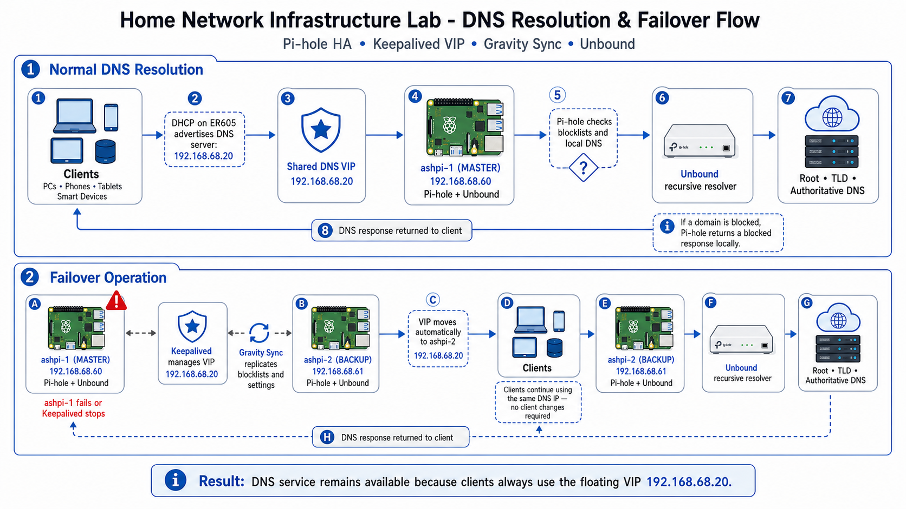

# Architecture Diagrams 🗺️

This folder contains the architecture diagrams for the completed Home Network Infrastructure Lab.

The diagrams show how the environment evolved from a basic home network into a high-availability DNS, monitoring, secure remote access, and Proxmox-hosted infrastructure foundation.

---

## Final Architecture

---

## DNS Resolution and Failover Flow

---

## Diagram Index

| Phase | Diagram | What It Shows |
|---|---|---|
| Phase 1 | [01-phase-1-previous-network-xfinity.png](01-phase-1-previous-network-xfinity.png) | Original Xfinity gateway and Deco routing baseline |
| Phase 1.5 | [02-phase-1-5-isp-migration-att.png](02-phase-1-5-isp-migration-att.png) | AT&T Fiber migration with ONT and IP Passthrough |
| Phase 2 | [03-phase-2-dns-control.png](03-phase-2-dns-control.png) | Pi-hole introduced as the network DNS control point |
| Phase 3 | [04-phase-3-ha-dns.png](04-phase-3-ha-dns.png) | Dual Pi-hole nodes, Keepalived VIP, Gravity Sync, and Unbound |
| Phase 4 | [05-phase-4-monitoring-alerting.png](05-phase-4-monitoring-alerting.png) | Prometheus, Grafana, Alertmanager, Blackbox, and Discord alerts |
| Phase 5 | [06-phase-5-remote-access-tailscale.png](06-phase-5-remote-access-tailscale.png) | Tailscale secure remote administration path |
| Phase 6 | [07-phase-6-proxmox-service-migration.png](07-phase-6-proxmox-service-migration.png) | Proxmox host, Omada Controller LXC, and monitoring VM migration |
| Phase 6.5 | [08-phase-6-5-rustdesk-proxmox.png](08-phase-6-5-rustdesk-proxmox.png) | RustDesk server on Proxmox with VM hardening context |

---

## Best Diagrams for Portfolio Review

| Diagram | Why It Matters |
|---|---|
| [04-phase-3-ha-dns.png](04-phase-3-ha-dns.png) | Shows the HA DNS design and floating VIP |
| [05-phase-4-monitoring-alerting.png](05-phase-4-monitoring-alerting.png) | Shows observability and alerting architecture |
| [06-phase-5-remote-access-tailscale.png](06-phase-5-remote-access-tailscale.png) | Shows secure remote administration without public SSH |
| [07-phase-6-proxmox-service-migration.png](07-phase-6-proxmox-service-migration.png) | Shows service migration from workstation dependency to Proxmox |
| [home-network-infra-lab-foundation.png](home-network-infra-lab-foundation.png) | Shows the final completed infrastructure foundation |
| [dns-resolution-and-failover-flow.png](dns-resolution-and-failover-flow.png) | Shows DNS resolution and failover behavior |

---

## Scope Boundary

This repository covers the HA DNS and core infrastructure foundation.

Managed router cutover, production VLAN segmentation, inter-VLAN firewall policy, and SSID-to-VLAN mapping belong in the separate network segmentation project.
