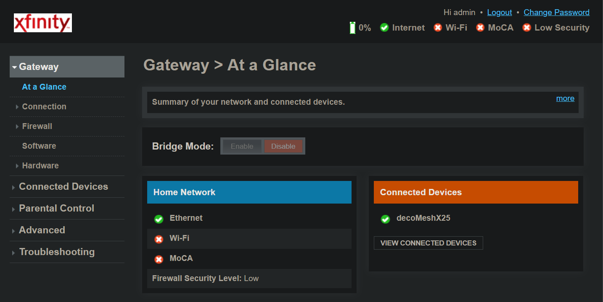
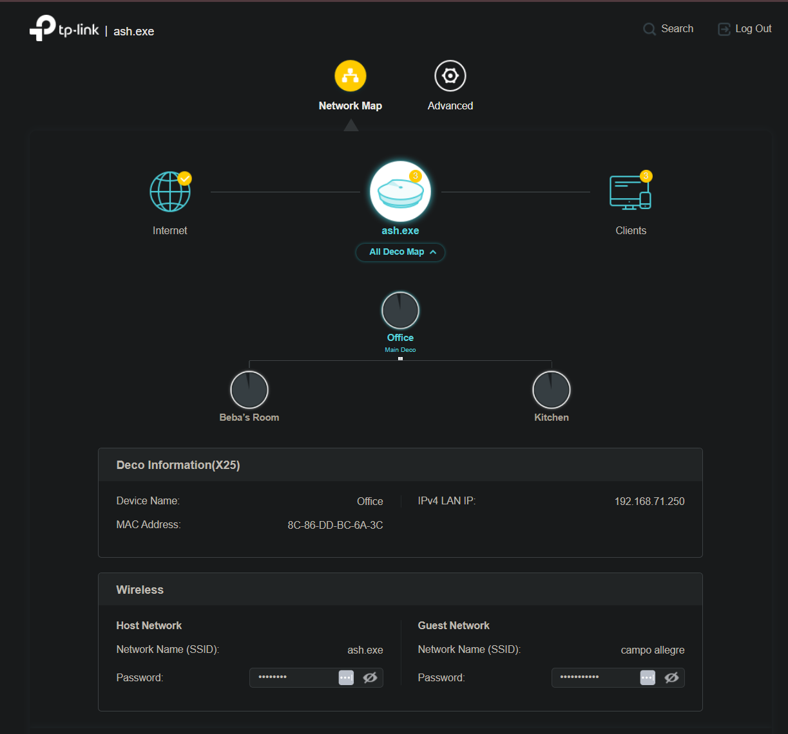
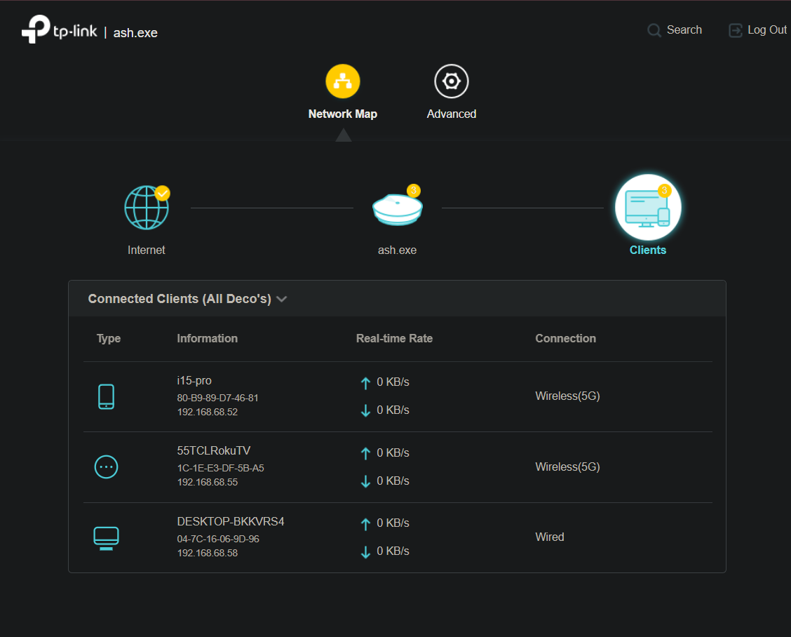

# Phase 1 — Securing and Taking Control of My Network

## 🚀 Introduction

Most home networks are fully controlled by the ISP. While convenient, that setup limits visibility, customization, and scalability.

This phase focused on taking control of the network layer by replacing ISP-managed routing with a self-managed mesh system.

---

## 🎯 Objective

* Remove ISP control over routing
* Eliminate double NAT
* Establish a clean network architecture
* Prepare for DNS control and high availability

---

## 🧰 Hardware Used

* TP-Link X25 Mesh System
* Xfinity Gateway
* D-Link 16-Port Switch
* Desktop
* Laptop

---

## 🧭 Network Before

```text
Internet → Xfinity Gateway → Devices
```

### ❌ Limitations

* ISP-controlled routing
* Limited flexibility
* Hard to scale into a real lab environment
* No centralized control over traffic

---

## 🧭 Network After

```text
Internet → Xfinity (Bridge Mode) → Deco Mesh (Router Mode) → Devices
```

### ✅ Improvements

* Routing controlled by the mesh system
* Double NAT removed
* Cleaner network path
* Better performance and stability
* Full control over network behavior

---

## 🔧 Key Changes Made

### 1. Mesh Network Deployment

* Set up TP-Link mesh system in router mode
* Established full-home WiFi coverage

---

### 2. Bridge Mode Enabled

* Disabled Xfinity routing
* Passed WAN IP directly to Deco
* Eliminated double NAT

---

### 3. ISP WiFi Disabled

* Prevented interference from multiple networks
* Ensured all devices use Deco

---

### 4. Switch Integration

* Expanded wired connectivity
* Enabled stable connections for desktop and future Pi nodes

---

### 5. Network Planning

* Reserved IP ranges for future services
* Prepared for Pi-hole and HA DNS

---

## 🔐 Security Impact

This phase improved network security by:

* Reducing reliance on ISP-managed routing
* Eliminating overlapping wireless networks
* Centralizing traffic through a single controlled router
* Creating a foundation for DNS filtering and monitoring

---

## ⚠️ Challenges Encountered

* Bridge mode did not fully disable WiFi initially
* Xfinity SSID continued broadcasting
* Required manual WiFi shutdown

---

## 🧠 Lessons Learned

* Always deploy new infrastructure before disabling old systems
* Bridge mode does not always disable WiFi automatically
* Clean architecture is critical before adding advanced services

---

## 📸 Screenshots

## Bridge Mode Enabled / ISP WiFi Disabled


## Deco Mesh Network Active



---

## ✅ Result

* Deco is now the primary router
* Xfinity is functioning as a modem only
* Network is stable and controlled
* Infrastructure is ready for DNS and HA

---

## 🔜 Next Step

Phase 2 will introduce Pi-hole for DNS control and network-wide filtering.
