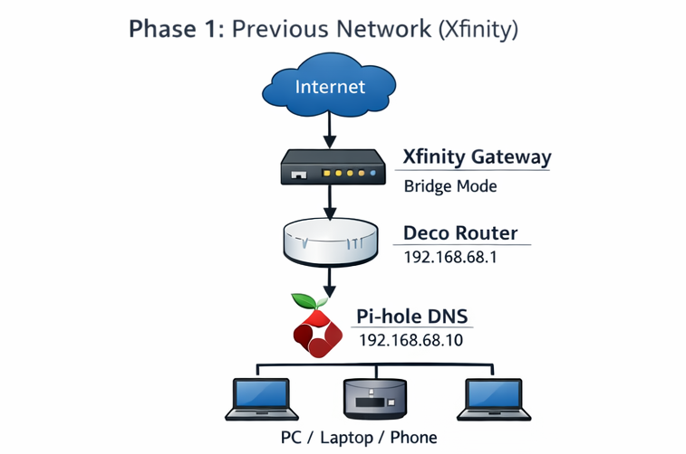

# Phase 1: Network Control 🧱


---

## Phase Summary

Phase 1 established the first controlled network baseline.

The goal was to move routing responsibility away from ISP-managed defaults and onto the Deco mesh system. This created a cleaner foundation for DNS control, monitoring, and future infrastructure work.

---

## What This Phase Demonstrates

| Area | Demonstrated Skill |
|---|---|
| Network baseline | Documented the original home network state |
| Router control | Moved routing to the Deco mesh system |
| Double NAT reduction | Used bridge mode to simplify the edge path |
| Wi-Fi cleanup | Removed duplicate ISP Wi-Fi broadcasts |
| Physical layout | Introduced a switch for wired expansion |
| Documentation | Captured before/after topology and screenshots |

---

## Architecture

```text
Before:
Internet → Xfinity Gateway → Clients

After:
Internet → Xfinity Gateway in Bridge Mode → Deco Router → Switch / Clients
```



---

## Phase Documentation

| Page | Description |
|---|---|
| [Overview](./overview.md) | Design intent, before/after topology, and lessons learned |
| [Step-by-Step Guide](./step-by-step.md) | Implementation sequence and validation checklist |

---

## Outcome

By the end of this phase, the network had a cleaner routing path, fewer ISP-managed dependencies, and a stable foundation for DNS control.
