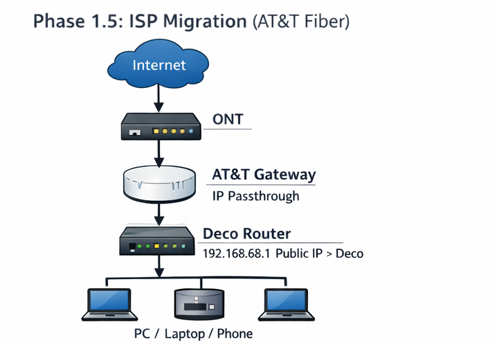

# Phase 1.5 — ISP Migration 🌐


---

## Phase Summary

Phase 1.5 documented the migration from Xfinity to AT&T Fiber.

The goal was to change the ISP edge while preserving the internal network design. The internal LAN, Deco routing layer, and DNS plan stayed consistent while the upstream connection changed to fiber.

---

## What This Phase Demonstrates

| Area | Demonstrated Skill |
|---|---|
| ISP migration | Replaced the upstream provider without redesigning the LAN |
| Edge troubleshooting | Worked around AT&T gateway behavior with IP Passthrough |
| Topology control | Preserved the internal network structure |
| Validation | Confirmed internet and DNS continued working after migration |
| Documentation | Captured the before/after ISP topology |

---

## Architecture

```text
Before:
Internet → Xfinity Gateway in Bridge Mode → Deco Router → Clients

After:
Internet → ONT → AT&T Gateway with IP Passthrough → Deco Router → Clients
```



---

## Phase Documentation

| Page | Description |
|---|---|
| [Overview](./overview.md) | Migration design, topology change, and lessons learned |
| [Step-by-Step Guide](./step-by-step.md) | Migration steps and validation checks |

---

## Outcome

The ISP changed, but the internal lab architecture stayed stable.
