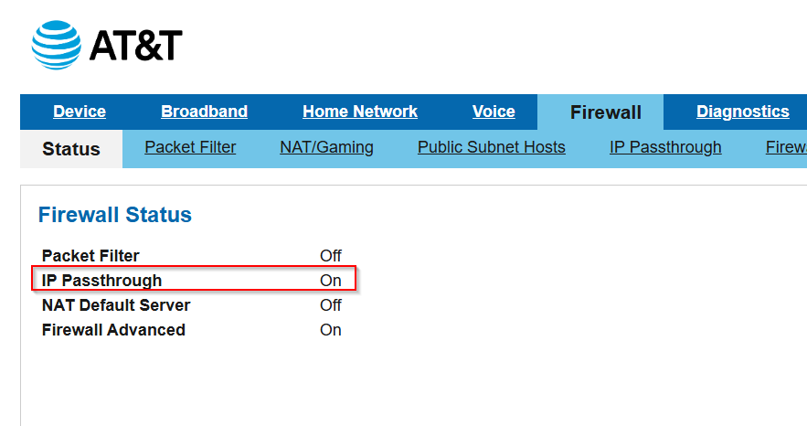
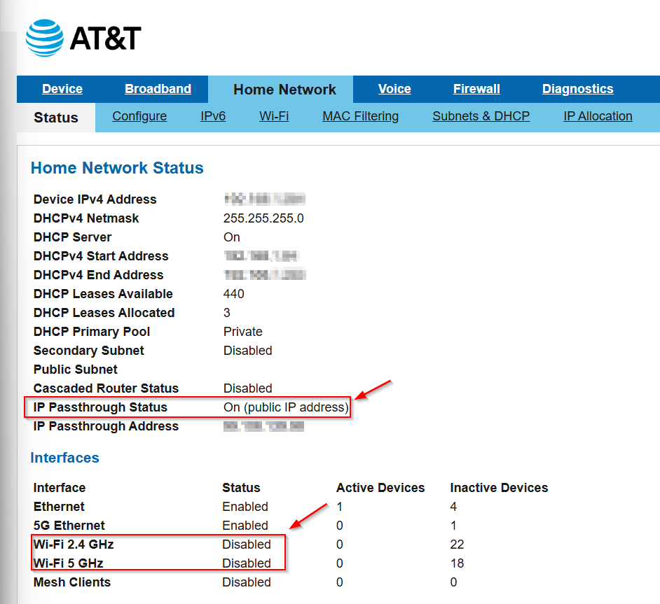
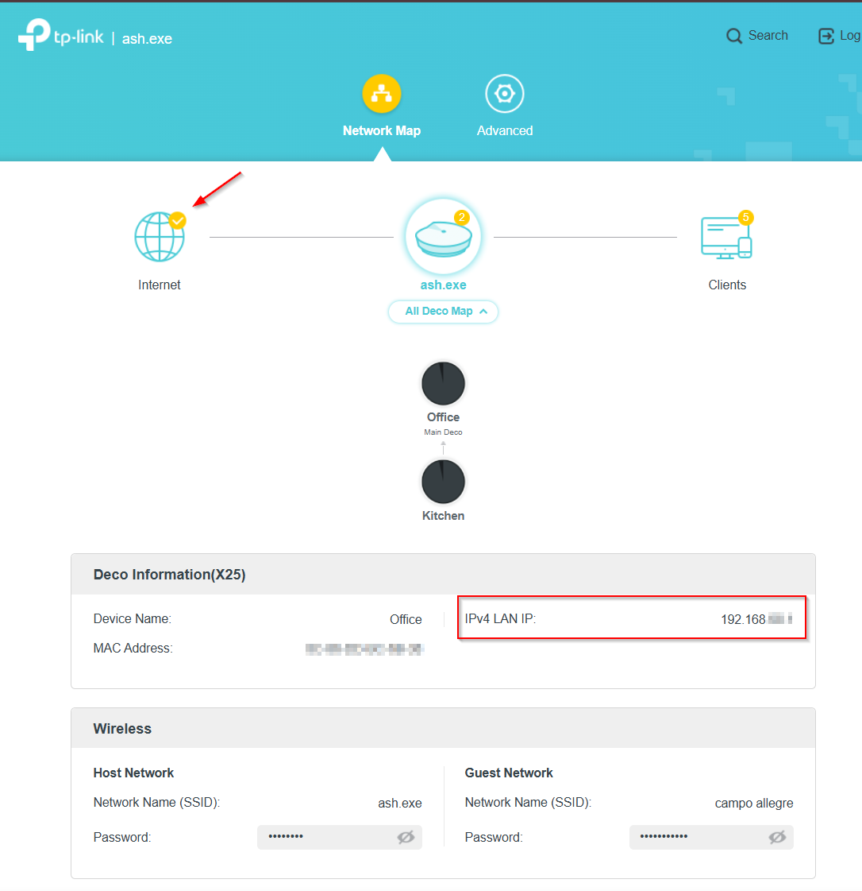
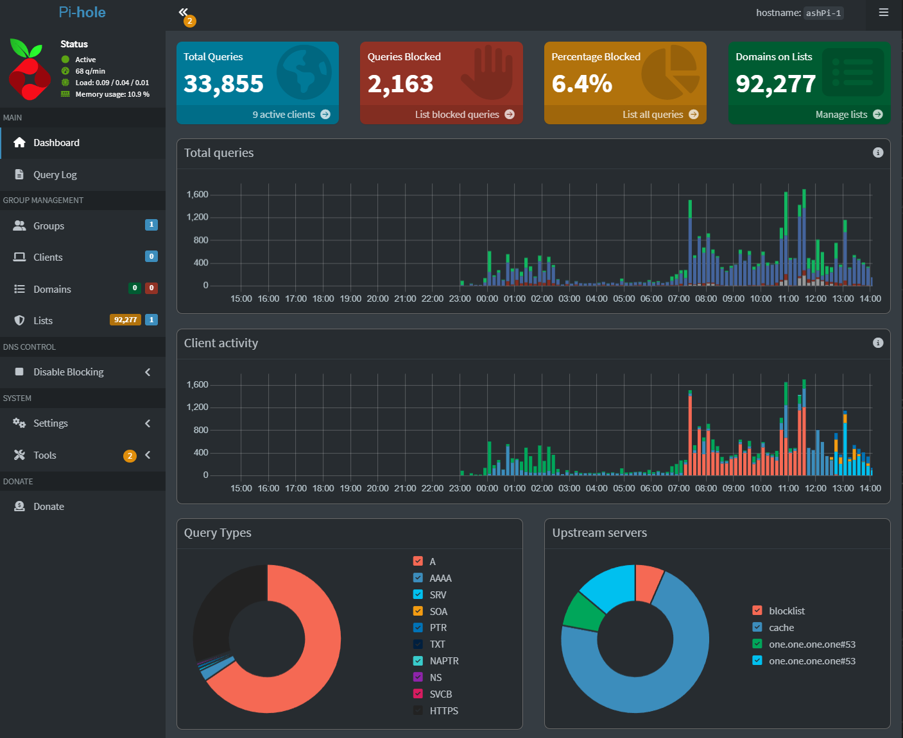

# Phase 1.5 – Step-by-Step Guide

## Goal

Migrate from Xfinity to AT&T Fiber while maintaining full network control and DNS functionality.

---

## Step 1 – Connect ONT to Gateway

* Fiber line terminates at ONT
* Connect Ethernet:

ONT → AT&T Gateway (WAN)

---

## Step 2 – Connect Gateway to Deco

* Use Ethernet:

AT&T Gateway (LAN) → Deco Router (WAN)

---

## Step 3 – Enable IP Passthrough

1. Go to: http://192.168.1.254
2. Navigate to Firewall → IP Passthrough
3. Set:

   * Allocation Mode: Passthrough
   * Mode: DHCPS-fixed
   * Device: Deco router
  

Save settings

---

## Step 4 – Reboot Devices

* Restart gateway
* Restart Deco router

---

## Step 5 – Disable Gateway WiFi

* Turn off 2.4 GHz and 5 GHz radios

---

## Step 6 – Verify Public IP

* Check Deco WAN IP
* Confirm it is NOT private

---

## Step 7 – Verify Pi-hole

* Open Pi-hole dashboard
* Confirm queries are active

---

## Step 8 – Test Connectivity

* Browse internet
* Run DNS test
* Confirm stable network

---

## Validation Checklist

* Deco receives public IP
* No double NAT
* Pi-hole receives queries
* Devices connect normally

---

## Result

* ISP successfully migrated
* Network control preserved
* DNS functionality maintained
