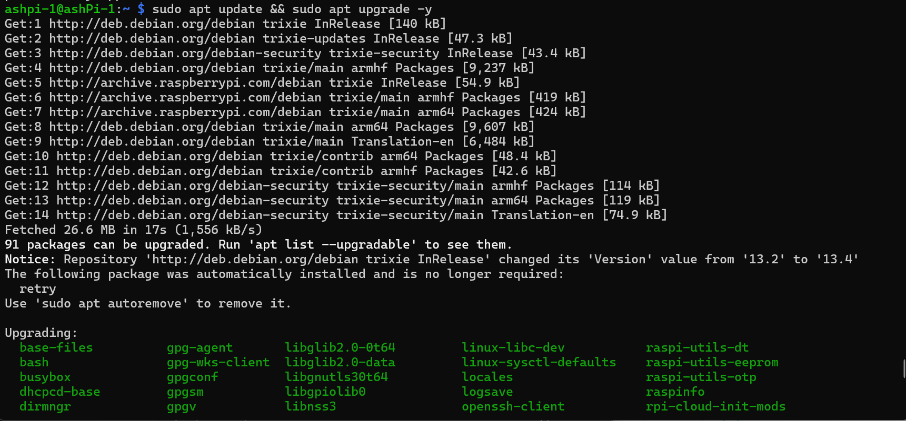

# Phase 2 — DNS Control with Pi-hole

## 🚀 Introduction

After establishing full control of the network in Phase 1, the next step was to control how traffic flows through the network.

This phase introduces **Pi-hole** as a centralized DNS server to enable:

* Network-wide ad blocking
* DNS-level traffic control
* Visibility into all DNS queries

---

## 🎯 Objective

* Deploy Pi-hole on a Raspberry Pi
* Route all network DNS traffic through it
* Validate blocking and visibility

---

## 🧰 Hardware Used

* Raspberry Pi (Primary DNS node)
* TP-Link Deco Mesh System
* Desktop + Laptop (test clients)

---

## 🧭 Architecture

```text
Internet → Deco Router → Pi-hole → Clients
```

---

## 🔧 Key Changes Made

### 1. Pi-hole Deployment

* Installed Pi-hole on Raspberry Pi
* Configured web interface and logging

---

### 2. DHCP DNS Configuration

* Set router DHCP DNS to Pi-hole IP
* Forced all clients to use Pi-hole

---

### 3. Network Integration

* Ensured all devices resolve DNS through Pi-hole
* Removed reliance on external DNS from clients

---

## 🔐 Impact

* Ads blocked across entire network
* Centralized DNS visibility
* Improved control over outbound traffic

---

## 📸 Screenshots

### Pi's on Deco Network


### Pi Update and Upgrade



### SSH Connection to Pi


### Pi-Hole Install


### Pi-Hole Install (Complete)


### Pi-hole Dashboard


### Live DNS Queries/ Ads Blocked


---

## 🧠 Lessons Learned

* DNS must be enforced via DHCP to affect all devices
* Devices require reconnect/restart to adopt new DNS
* Centralized DNS dramatically improves visibility

---

## ✅ Result

* All devices now use Pi-hole for DNS
* Queries are visible in real-time
* Ads and tracking domains are blocked network-wide

---

## 🔜 Next Step

Phase 3 will introduce **high availability (HA)** to eliminate the DNS single point of failure.
