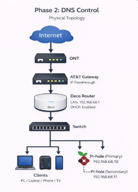

# Phase 2 — DNS Control with Pi-hole 🕳️


---

## Phase Summary

Phase 2 introduced Pi-hole as the network DNS control point.

The goal was to route client DNS through a self-managed DNS service instead of relying only on upstream resolvers or default router behavior.

---

## What This Phase Demonstrates

| Area | Demonstrated Skill |
|---|---|
| DNS control | Centralized DNS through Pi-hole |
| DHCP integration | Router handed out Pi-hole as DNS |
| Visibility | DNS queries became visible by client |
| Filtering | Ads and tracking domains were blocked |
| Validation | Confirmed clients used the Pi-hole resolver |

---

## Architecture

```text
Internet → Deco Router → Pi-hole DNS → Clients
```



---

## Phase Documentation

| Page | Description |
|---|---|
| [Overview](./overview.md) | Pi-hole design and DNS control goals |
| [Step-by-Step Guide](./step-by-step.md) | Installation, DHCP DNS changes, and validation |

---

## Outcome

By the end of this phase, DNS became a managed service instead of a background router default.
