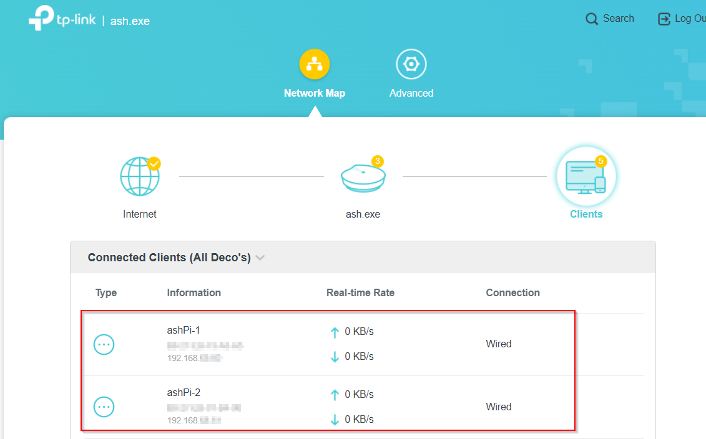
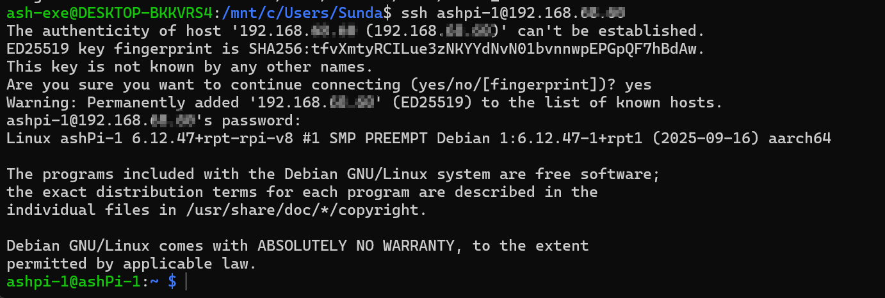
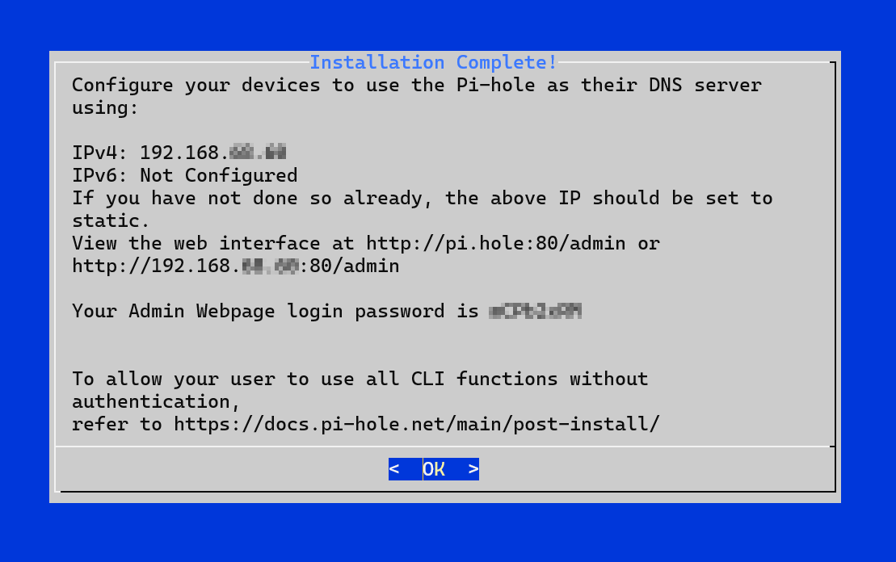
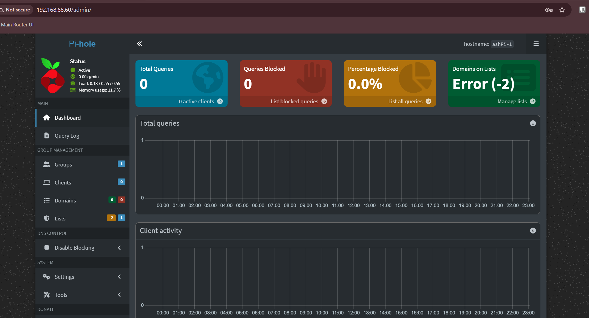
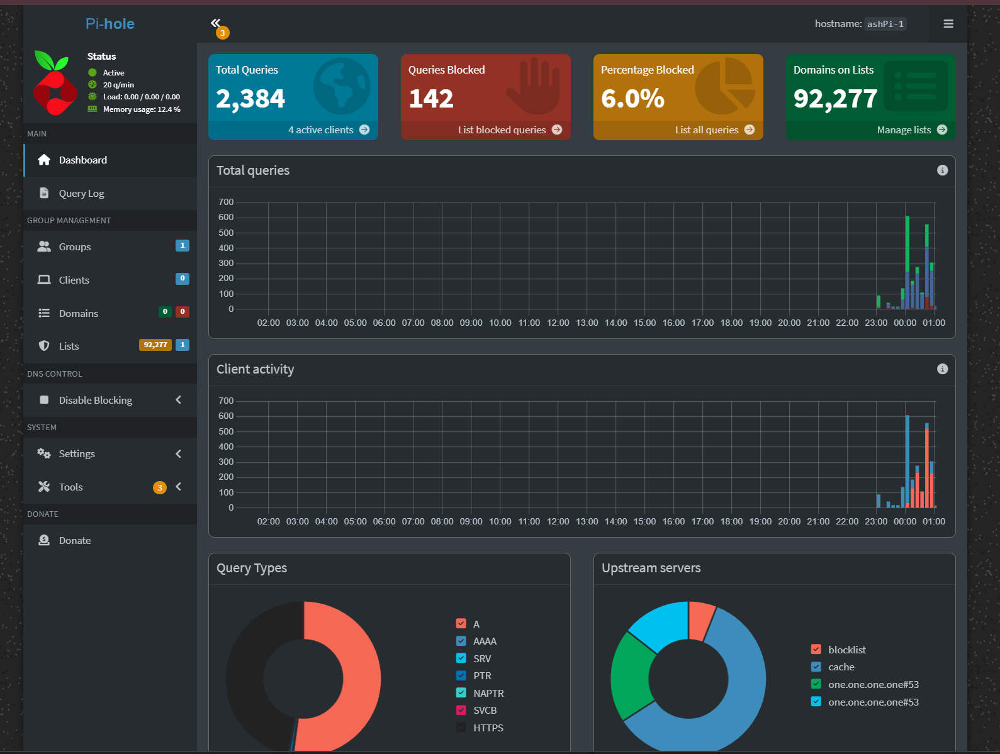
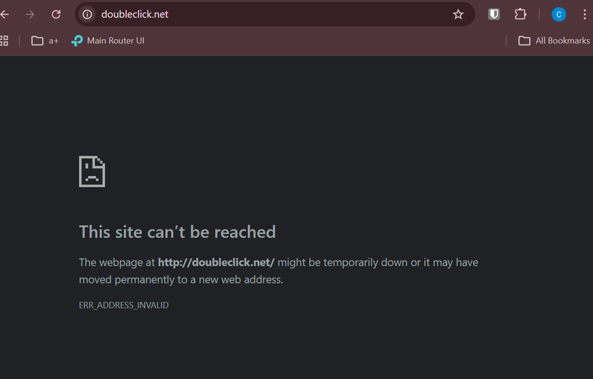

# Phase 2 – Step-by-Step Guide

## Goal

Deploy Pi-hole as the primary DNS server so all devices on the network use centralized DNS filtering and logging.

---

## Step 1 – Boot and Connect Pi

1. Insert SD card into Raspberry Pi  
2. Connect Ethernet to switch  
3. Power on Pi  
4. Wait 1–2 minutes  

### Verify

- Pi appears in network

---

## Step 2 – SSH into Pi

From your terminal:

ssh pi@192.168.1.10

### Verify

- SSH login successful

---

## Step 3 – Update System

Run:

sudo apt update && sudo apt upgrade -y

### Verify

- System updates successfully

---

## Step 4 – Install Pi-hole

Run:

curl -sSL https://install.pi-hole.net | bash

### During setup choose:

- Interface: eth0  
- Static IP: 192.168.1.10  
- Upstream DNS: Cloudflare  
- Web UI: Yes  
- Logging: Yes  

### Verify

- Installation completes successfully

---

## Step 5 – Access Dashboard

Open:

http://192.168.1.10/admin

### Verify

- Dashboard loads

---

## Step 6 – Configure DNS in Router

In Deco app:

- Advanced → DHCP Server  
- Set Primary DNS to:

[EX: 192.168.1.10] 

### Verify

- DNS applied

---

## Step 7 – Verify DNS Traffic

Refresh Pi-hole dashboard

### Verify

- Queries increasing  
- Devices listed  

---

## Step 8 – Test Ad Blocking

Open:

http://doubleclick.net

### Verify

- Page blocked or fails to load

---

## Final Validation Checklist

- Pi reachable at reserved IP  
- SSH works  
- Pi-hole dashboard accessible  
- DNS configured in router  
- Queries visible in dashboard  
- Devices browsing normally  
- Ads blocked  

---

## Result

- Pi-hole is now the network DNS server  
- DNS traffic is centralized  
- Ad/tracking domains are blocked  
- Network visibility is improved  

---

## Next Step

Proceed to Phase 3:

- Add second Pi-hole node  
- Configure Gravity Sync  
- Implement Keepalived  
- Create virtual IP for failover  
