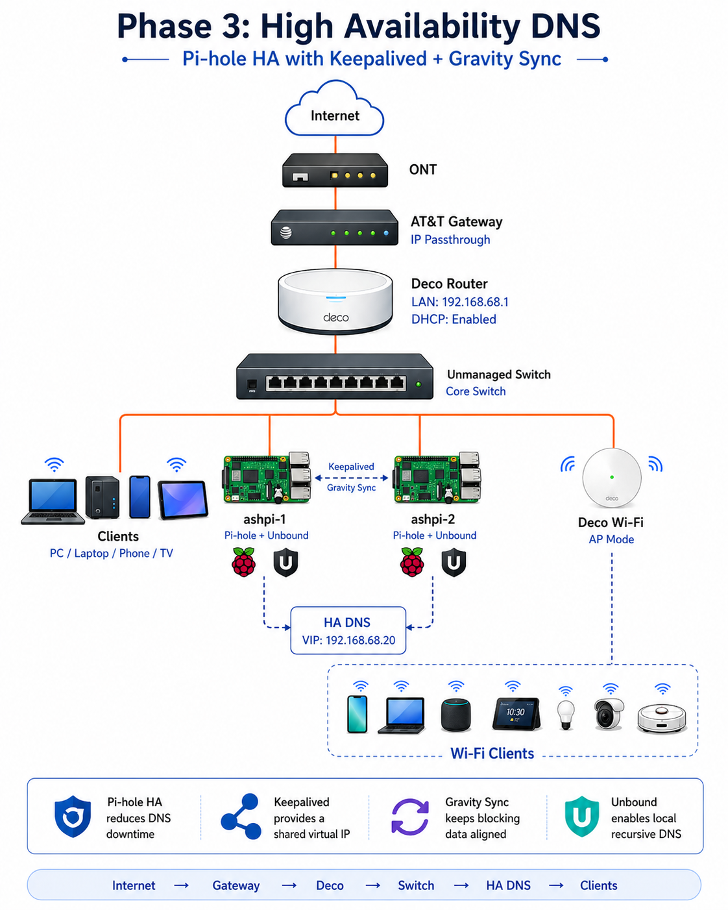

# Phase 3 — High Availability DNS 🛡️


---

## Phase Summary

Phase 3 removed the single-DNS-server risk by adding a second Pi-hole node and a shared virtual IP.

The result was a more resilient DNS layer that allowed clients to continue using one DNS address while Keepalived handled node failover.

---

## What This Phase Demonstrates

| Area | Demonstrated Skill |
|---|---|
| High availability | Dual Pi-hole nodes with a shared VIP |
| Failover | Keepalived moves DNS service between nodes |
| Replication | Gravity Sync keeps Pi-hole configuration aligned |
| Recursive DNS | Unbound runs locally on both DNS nodes |
| Validation | DNS stayed available during failover testing |

---

## Architecture

```text
Clients
  ↓
HA DNS VIP - 192.168.68.20
  ↓
ashpi-1 / ashpi-2
  ↓
Pi-hole + Unbound
```



---

## Phase Documentation

| Page | Description |
|---|---|
| [Overview](./overview.md) | HA DNS architecture and design notes |
| [Step-by-Step Guide](./step-by-step.md) | Implementation flow |
| [Jump Box Access](./jump-box-access.md) | SSH access and admin workflow |
| [Validation and Failover Tests](./validation-and-failover-tests.md) | Proof of failover behavior |
| [Diagrams](./diagrams.md) | HA DNS diagrams |
| [DNS Recursion with Unbound](unbound-recursive-dns.md) | Local recursive DNS notes |

---

## Outcome

The lab moved from single-node DNS to a redundant DNS architecture with a stable client-facing VIP.
