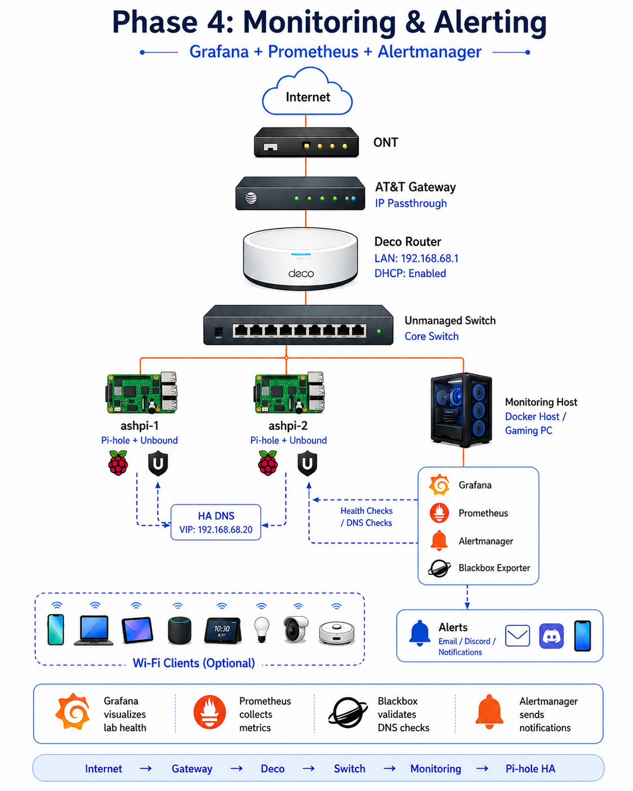

# Phase 4: Monitoring & Alerting 📊


---

## Phase Summary

Phase 4 added observability to the infrastructure lab.

This phase introduced Prometheus, Grafana, Alertmanager, Blackbox Exporter, Node Exporter, and Discord alert delivery to monitor service health and validate infrastructure availability.

---

## What This Phase Demonstrates

| Area | Demonstrated Skill |
|---|---|
| Metrics collection | Prometheus target scraping |
| Dashboards | Grafana visualization |
| Alerting | Alertmanager routing and lifecycle |
| Availability checks | Blackbox Exporter probing |
| Host metrics | Node Exporter |
| Notifications | Discord alert delivery |
| Validation | Pending, firing, recovery, and failover behavior |

---

## Monitoring Flow

```text
Node Exporter / Blackbox Exporter
  ↓
Prometheus
  ↓
Grafana Dashboards
  ↓
Alertmanager
  ↓
Discord Alerts
```



---

## Phase Documentation

| Page | Description |
|---|---|
| [Overview](./overview.md) | Monitoring and alerting case study |
| [Step-by-Step Guide](./step-by-step.md) | Implementation flow |
| [Dashboards](./dashboards.md) | Grafana dashboard notes |
| [Alerting](./alerting.md) | Alertmanager and Discord routing |
| [Validation](./validation.md) | Monitoring and alert testing evidence |

---

## Outcome

The lab moved from manually checking services to actively monitoring infrastructure health and alert behavior.
