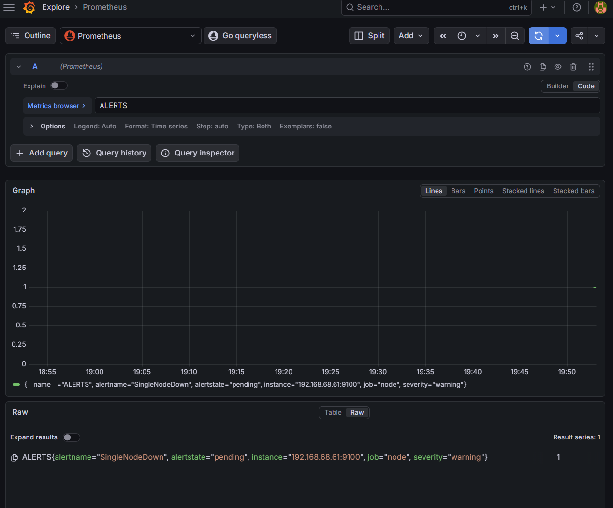
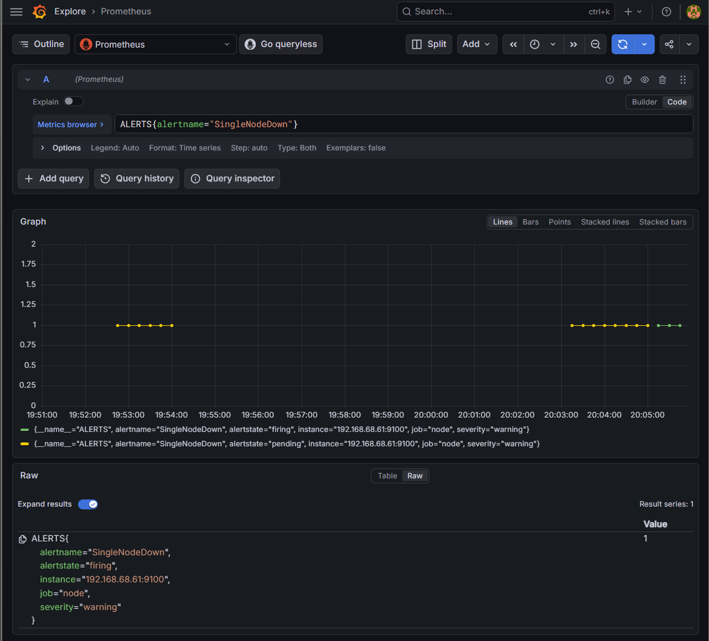
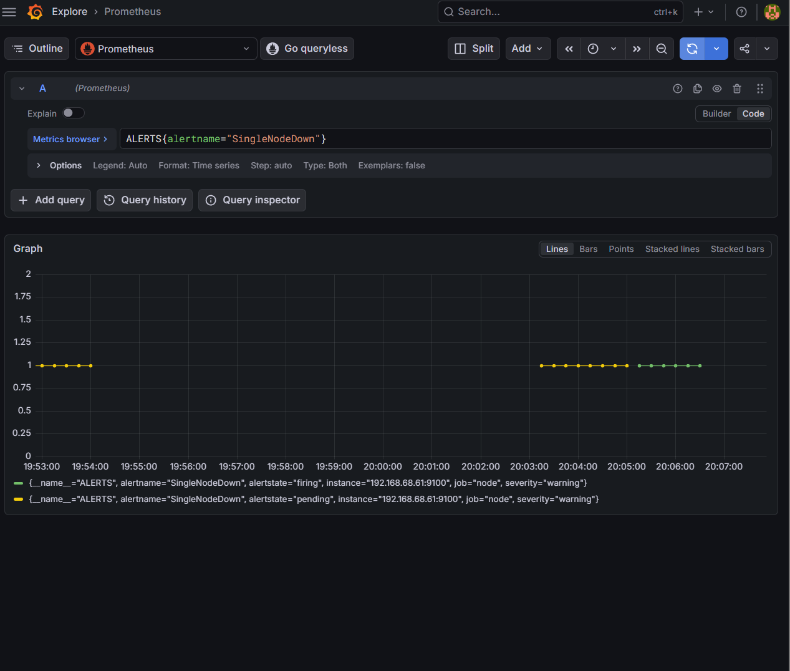
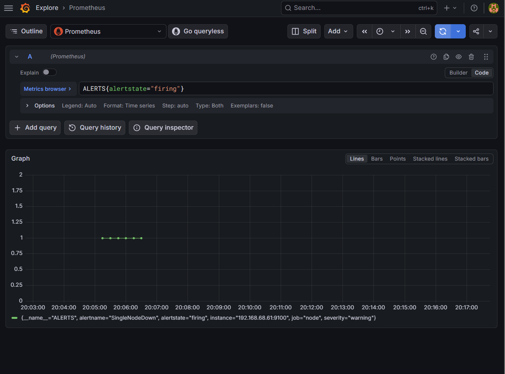
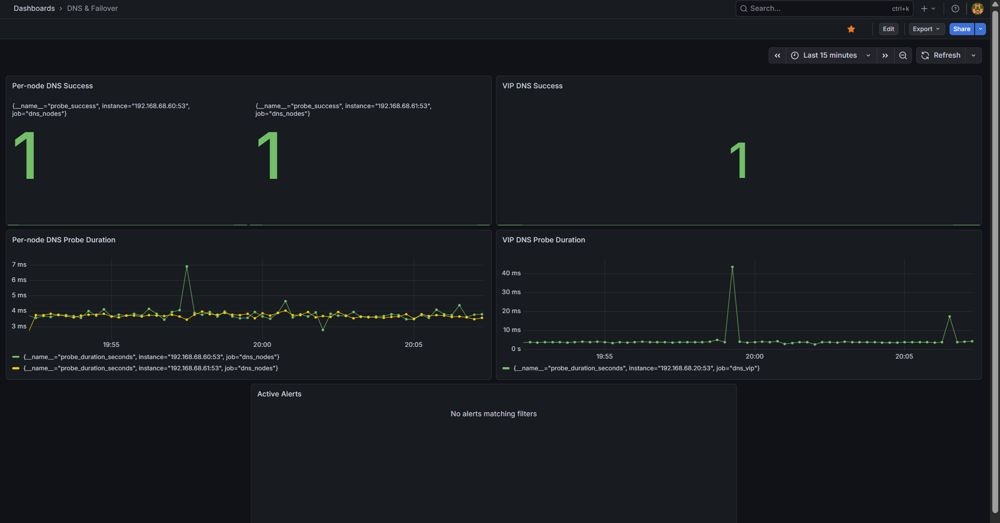

# Phase 4 — Alerting 🚨

---

## Quick Navigation

| Page | Link |
|---|---|
| Phase Home | [README](README.md) |
| Overview | [overview.md](overview.md) |
| Step-by-Step Guide | [step-by-step.md](step-by-step.md) |
| Dashboards | [dashboards.md](dashboards.md) |
| Alerting | [alerting.md](alerting.md) |
| Validation | [validation.md](validation.md) |
| Documentation Hub | [docs/](../README.md) |

---


## 📖 Overview

This document describes the alerting logic used during Phase 4.

The main goal was to build alerts that are:

- useful
- low-noise
- service-impact focused
- aware of the difference between degraded redundancy and real outages
- routed to Discord through Alertmanager

---

## 🎯 Alerting Philosophy

The alerting model used in this phase was based on a simple principle:

**Alert on service impact first.**

That means:

- a healthy failover should not be treated like a critical outage
- losing one node should be treated as degraded redundancy, not total failure
- losing the VIP should be treated as the primary DNS service outage condition
- notification delivery should be useful without creating unnecessary noise

This made the alerts easier to trust.

---

## Severity Model

### Critical

Used when DNS service is actually impacted or both HA nodes are unavailable.

### Warning

Used when redundancy or performance is degraded, but service may still be available.

### Informational / degraded state

Used for failover visibility or conditions that indicate HA worked but redundancy changed.

---

## Alert Rules Used

### VIPDNSDown

**Purpose**

Detect when the HA DNS VIP is no longer answering DNS probes.

**Type**

- Critical

**Why it matters**

This is the main service-impact DNS alert for the environment.

---

### SingleNodeDown

**Purpose**

Detect when one monitored Raspberry Pi node is no longer reachable through Node Exporter.

**Type**

- Warning

**Why it matters**

DNS may still be available, but redundancy is degraded.

---

### BothNodesDown

**Purpose**

Detect when both monitored Raspberry Pi nodes are unreachable.

**Type**

- Critical

**Why it matters**

This indicates a major outage condition.

---

### VIPDNSLatencyHigh

**Purpose**

Detect elevated DNS probe response time for the VIP over a sustained window.

**Type**

- Warning

**Why it matters**

This helps identify DNS degradation before a full failure occurs.

---

### DNSNodeProbeFailed

**Purpose**

Detect when direct probing of one Pi-hole DNS endpoint fails.

**Type**

- Warning

**Why it matters**

This helps identify problems on a specific node even if the VIP still appears healthy.

---

## Why `for:` Durations Were Used ⏱️

Each alert rule used a `for:` duration so alerts would not fire immediately on a brief scrape issue or transient network blip.

Examples:

- `1m` for VIP DNS down
- `2m` for single node down
- `10m` for elevated DNS latency
- `15m` for CPU, memory, and disk pressure conditions

This made the alert set cleaner and reduced flapping.

---

## Alertmanager Routing 🔔

Alertmanager was configured to route Prometheus alerts to Discord.

The alert path is:

```text
Prometheus alert.rules.yml
        ↓
Alertmanager
        ↓
Discord webhook
        ↓
homelab-alerts
```

### Discord Receiver

The receiver name inside Alertmanager does not need to match the Discord server name. It only needs to match the route configuration.

Example:

```yaml
route:
  receiver: discord-home-lab

receivers:
  - name: discord-home-lab
```

The Discord server/channel destination is controlled by the webhook URL.

---

## Discord Webhook Secret Handling 🔐

The Discord webhook URL is stored locally on the monitoring host.

### Host path

```text
alertmanager/secrets/discord_webhook_url
```

### Container path

```text
/etc/alertmanager/secrets/discord_webhook_url
```

### Docker Compose mount

```yaml
- ./alertmanager/secrets:/etc/alertmanager/secrets:ro
```

### Alertmanager config

```yaml
discord_configs:
  - webhook_url_file: /etc/alertmanager/secrets/discord_webhook_url
    send_resolved: true
```

The secret file is excluded from Git using `.gitignore`.

```gitignore
# Alertmanager secrets
alertmanager/secrets/
*.secret
.env
```

---

## Discord Alert Delivery Validation ✅

Discord alert delivery was validated by sending a manual test alert directly to Alertmanager.

This confirmed:

- the webhook file existed on the host
- the webhook file was mounted into the Alertmanager container
- Alertmanager could read the webhook file
- Alertmanager could send the firing alert to Discord
- resolved alert delivery was enabled with `send_resolved: true`

A key troubleshooting step was recreating the Alertmanager container after adding the new secret mount:

```bash
docker compose up -d --force-recreate alertmanager
```

A normal restart was not enough because the container needed to be recreated for the new volume mount to appear.

---

## Active Alert Validation

The alert set was validated by deliberately triggering and restoring conditions.

### SingleNodeDown lifecycle test

A full pending → firing → cleared test was performed by stopping and restoring Node Exporter on `ashpi-2`.

This confirmed:

- the rule loaded successfully
- the `for:` timer behaved correctly
- the alert fired correctly
- the alert cleared correctly after recovery
- Discord notification routing worked through Alertmanager







---

## Failover Alert Behavior 🔁

A keepalived failover test was performed during Phase 4 to confirm that monitoring correctly understood a healthy failover.

### Expected behavior during healthy failover

- the VIP moves to the standby node
- DNS service through the VIP remains healthy
- `VIPDNSDown` does not fire
- dashboards continue to show service continuity
- Discord does not receive a false critical VIP outage alert

### Why this matters

This confirms that the monitoring stack can distinguish between:

- a real outage
- a degraded redundancy event
- a healthy HA failover

That distinction is one of the most important outcomes of Phase 4.



---

## Active Alerts in Grafana 📋

The **DNS & Failover** dashboard includes an **Active Alerts** panel so currently pending or firing alerts can be seen directly from the operational dashboard.

This gives a quick summary of alert state without leaving the dashboard view.



---

## Future Alerting Improvements

Later improvements could include:

- additional Discord routing by severity
- separate notification channels for warning and critical alerts
- maintenance silencing
- alert templates with cleaner summaries
- more advanced failover-state alert logic

---

## 🏁 Result

The Phase 4 alerting implementation successfully delivered:

- useful warning and critical conditions
- a cleaner low-noise alert set
- validated alert lifecycle behavior
- Alertmanager-based Discord alert delivery
- correct interpretation of healthy HA failover
