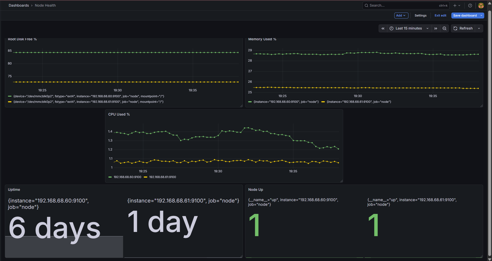
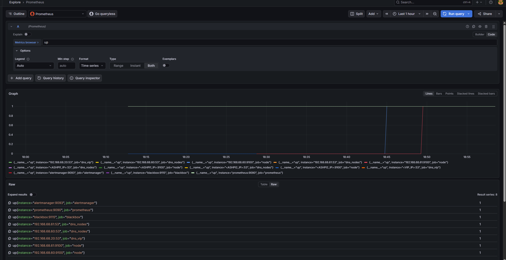
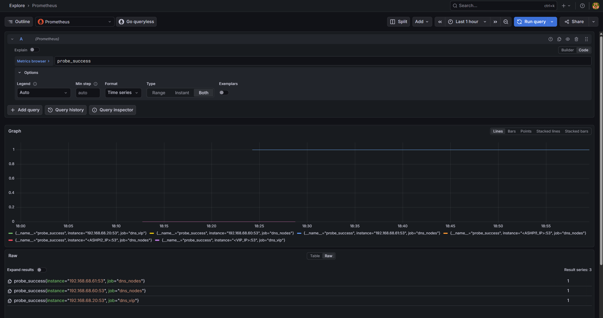
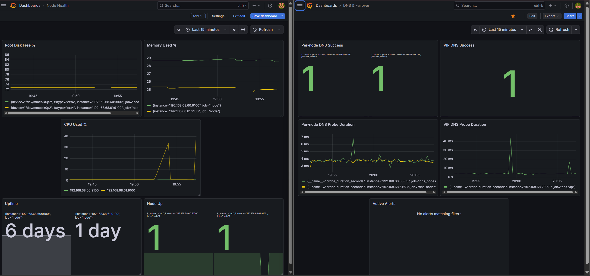
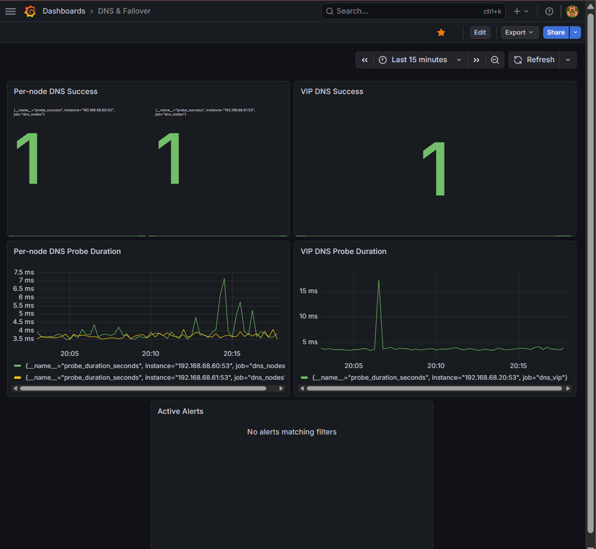

# Phase 4 — Dashboards 📊

## 📖 Overview

This document describes the Grafana dashboards created during Phase 4.

Two dashboards were built:

- **Phase 4 — Node Health**
- **Phase 4 — DNS & Failover**

These dashboards were designed to provide quick operational visibility without creating unnecessary noise.

---

## Dashboard 1 — Phase 4: Node Health 🖥️

This dashboard focuses on host-level visibility for both Raspberry Pi nodes.

### Panel: Node Up

**Purpose**

Shows whether each Node Exporter target is currently reachable.

**Query**

```promql
up{job="node"}
```

**Visualization**

- Stat

**Configuration notes**

- query type set to **Instant**
- calculation set to **Last not null**

---

### Panel: CPU Used %

**Purpose**

Shows CPU utilization trend over time for both nodes.

**Query**

```promql
100 - (avg by (instance) (rate(node_cpu_seconds_total{job="node",mode="idle"}[5m])) * 100)
```

**Visualization**

- Time series

---

### Panel: Memory Used %

**Purpose**

Shows memory usage trend over time.

**Query**

```promql
(1 - (node_memory_MemAvailable_bytes{job="node"} / node_memory_MemTotal_bytes{job="node"})) * 100
```

**Visualization**

- Time series

---

### Panel: Root Disk Free %

**Purpose**

Shows the remaining free space percentage on the root filesystem.

**Query**

```promql
(node_filesystem_avail_bytes{job="node",mountpoint="/",fstype!~"tmpfs|overlay"} / node_filesystem_size_bytes{job="node",mountpoint="/",fstype!~"tmpfs|overlay"}) * 100
```

**Visualization**

- Time series

---

### Panel: Uptime

**Purpose**

Shows current uptime for each node.

**Query**

```promql
time() - node_boot_time_seconds{job="node"}
```

**Visualization**

- Stat

**Configuration notes**

- query type set to **Instant**
- calculation set to **Last not null**
- unit set to **duration (s)**
- neutral color used to avoid treating high uptime as a failure condition



---

## Dashboard 2 — Phase 4: DNS & Failover 🌐

This dashboard focuses on service health for the HA DNS platform.

### Panel: VIP DNS Success

**Purpose**

Shows whether the HA DNS VIP is currently answering probes successfully.

**Query**

```promql
probe_success{job="dns_vip"}
```

**Visualization**

- Stat

**Configuration notes**

- query type set to **Instant**
- calculation set to **Last not null**

---

### Panel: Per-node DNS Success

**Purpose**

Shows whether direct DNS probes to each Pi-hole node are succeeding.

**Query**

```promql
probe_success{job="dns_nodes"}
```

**Visualization**

- Stat

**Configuration notes**

- query type set to **Instant**
- calculation set to **Last not null**

---

### Panel: VIP DNS Probe Duration

**Purpose**

Shows the response time trend for DNS probes against the VIP.

**Query**

```promql
probe_duration_seconds{job="dns_vip"}
```

**Visualization**

- Time series

---

### Panel: Per-node DNS Probe Duration

**Purpose**

Shows the response time trend for direct DNS probes against each node.

**Query**

```promql
probe_duration_seconds{job="dns_nodes"}
```

**Visualization**

- Time series

---

### Panel: Active Alerts

**Purpose**

Shows currently pending or firing alerts related to the monitoring stack and HA DNS service path.

**Visualization**

- Alert list


---

## Dashboard Design Notes 📝

Several cleanup adjustments were made after the initial build:

- stat panels were switched to **Instant** mode
- stat panels used **Last not null** to avoid showing historical placeholder data
- dashboard time ranges were adjusted to reduce confusion from old bad series
- uptime styling was changed to avoid showing large uptime values as failures





---

## Operational Use

These two dashboards provide both layers of visibility needed for the environment.

### Node Health

Answers:

- are both Raspberry Pi nodes up?
- are CPU, memory, and disk conditions healthy?
- has either node rebooted?

### DNS & Failover

Answers:

- is the VIP currently healthy?
- are both direct DNS nodes healthy?
- is probe latency normal?
- are any relevant alerts active?
- did failover preserve DNS availability?





---

## 🏁 Result

The dashboards created in Phase 4 provide:

- quick host visibility
- quick DNS service visibility
- useful trend data over time
- active alert visibility
- a cleaner operational view of HA behavior during failover
