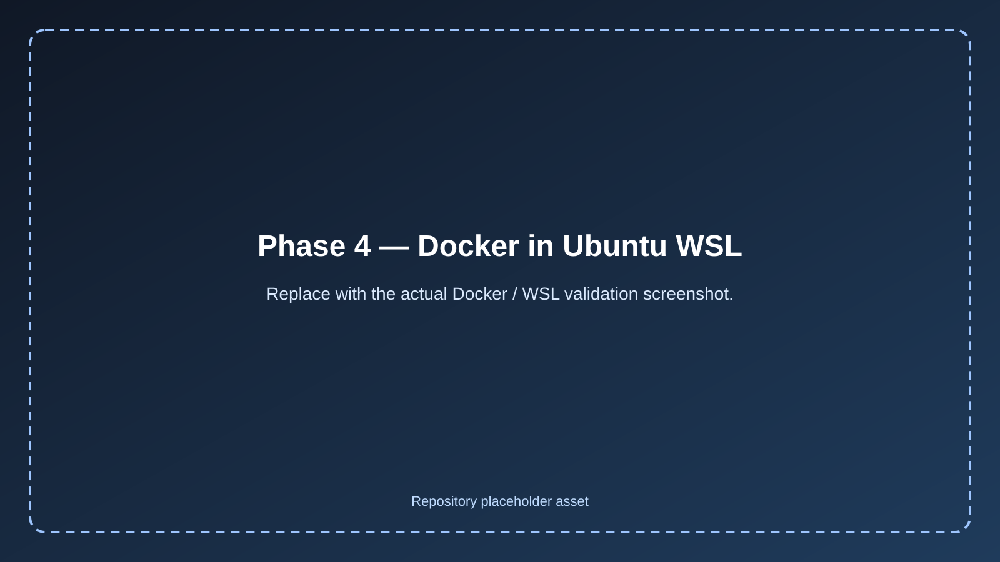
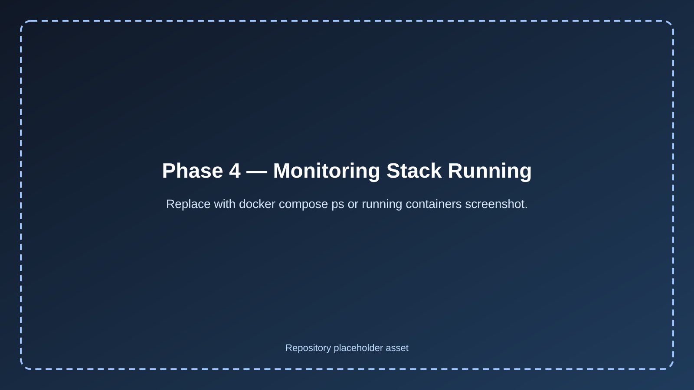
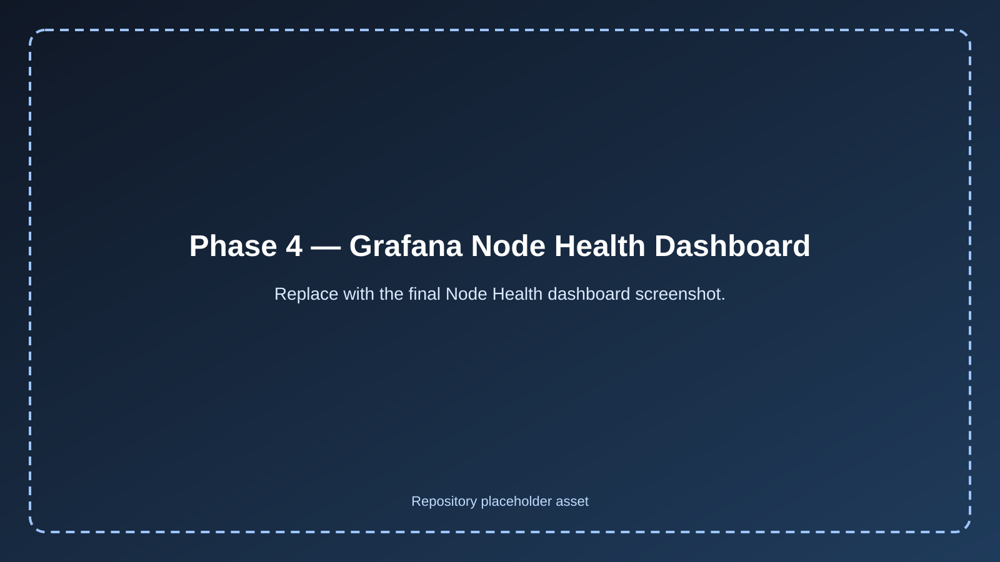
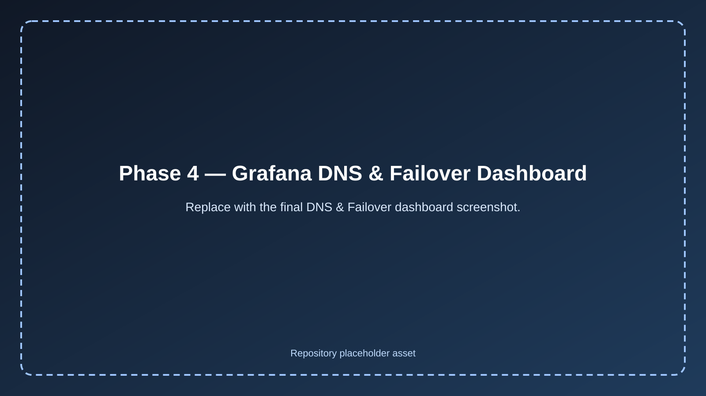
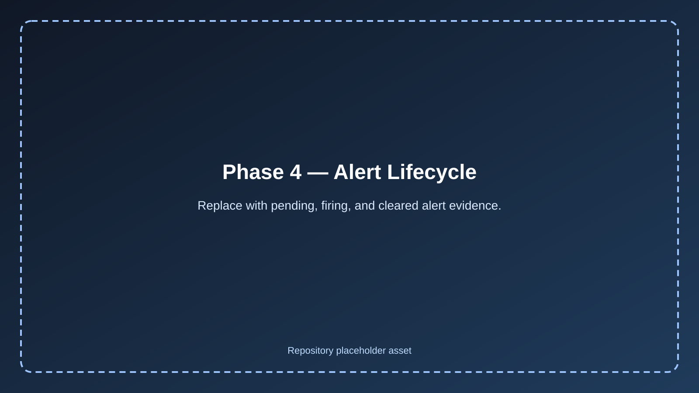
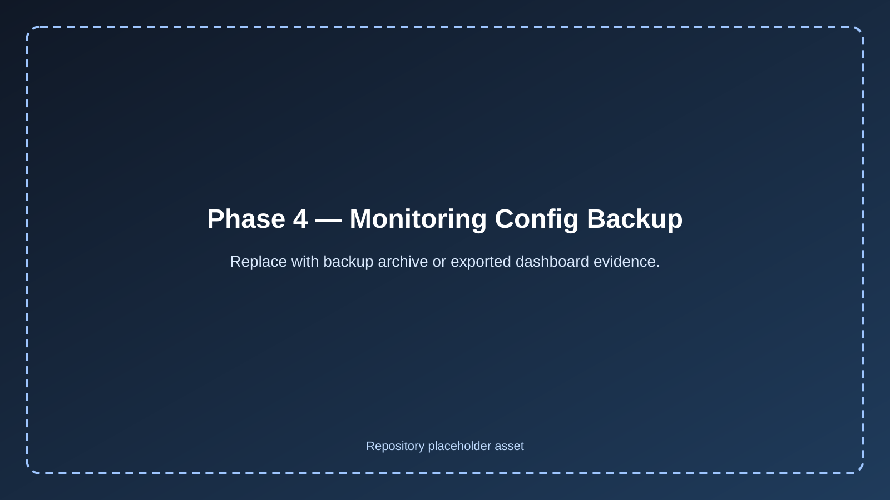

# Phase 4 — Monitoring & Alerting Overview 📈

## 📖 Overview

Phase 4 adds the **observability layer** to the HA DNS platform that was completed in Phase 3.

By the end of Phase 3, the lab already had:

* dual Pi-hole nodes
* Gravity Sync replication
* keepalived VIP-based failover
* Unbound recursive DNS on both nodes
* validated DNS continuity during failover

Phase 4 builds on that foundation by introducing monitoring and alerting for:

* node health visibility
* DNS service availability
* failover behavior
* alert lifecycle validation

---

## 🎯 Objectives

The goals of this phase were to:

* monitor the health of both Raspberry Pi nodes
* monitor the HA DNS VIP and direct node DNS endpoints
* track host resource usage over time
* create dashboards for quick visibility
* implement alerting with reduced noise
* confirm monitoring reflects healthy failover correctly

---

## 🧱 Monitoring Stack

The monitoring stack introduced in this phase includes:

### Prometheus

Prometheus was used as the metrics collection and alert rule engine.

### Grafana

Grafana was used for:

* dashboard creation
* metric visualization
* query testing through Explore

### Alertmanager

Alertmanager was used to manage active alert states and support grouped alert handling.

### Blackbox Exporter

Blackbox Exporter was used to probe:

* the HA DNS VIP
* `ashpi-1` direct DNS
* `ashpi-2` direct DNS

### Node Exporter

Node Exporter was installed on both Raspberry Pi nodes to expose host-level system metrics such as:

* CPU usage
* memory usage
* disk usage
* uptime
* node availability

---

## 🖥️ Monitoring Host Design

For Phase 4, the monitoring stack was deployed on a **temporary always-on gaming PC** using:

* Docker Desktop
* Ubuntu WSL
* a UPS-backed desktop environment

This allowed the observability layer to be completed without introducing another hardware purchase immediately.

Long term, the monitoring stack can be migrated to a dedicated management host or mini workstation for better separation of duties.

---

## 🌐 Monitored Endpoints

The following targets were monitored during this phase:

* `ashpi-1` node metrics — `192.168.68.60:9100`
* `ashpi-2` node metrics — `192.168.68.61:9100`
* HA DNS VIP probe — `192.168.68.20:53`
* `ashpi-1` direct DNS probe — `192.168.68.60:53`
* `ashpi-2` direct DNS probe — `192.168.68.61:53`

---

## 🛡️ Security Approach

The monitoring stack was intentionally kept **LAN-only**.

Key security decisions included:

* only Grafana was published on port `3000`
* Prometheus was not exposed directly
* Alertmanager was not exposed directly
* Blackbox Exporter was not exposed directly
* Node Exporter was not exposed through the router
* no monitoring services were port-forwarded to the internet

This kept the observability layer useful for administration without creating unnecessary external exposure.

---

## 📊 Dashboards Created

Two primary dashboards were created:

### 1. Node Health

This dashboard focused on host-level visibility for both Raspberry Pi nodes.

It included:

* node up/down state
* CPU usage
* memory usage
* root disk free percentage
* uptime

### 2. DNS & Failover

This dashboard focused on the DNS service path and HA behavior.

It included:

* VIP DNS success
* per-node DNS success
* VIP probe duration
* per-node probe duration
* active alerts

---

## 🚨 Alerting Strategy

The alerting model focused on **service impact first**.

### Critical Alerts

* VIP DNS down
* both nodes down

### Warning Alerts

* single node down
* direct DNS node probe failed
* elevated VIP DNS latency

### Informational / Degraded State

* failover-related conditions where redundancy is degraded but service remains available

This helped reduce noise and avoid treating a healthy failover as a critical outage.

---

## ✅ Validation Summary

Phase 4 was validated by confirming:

* both Node Exporter targets were scraped successfully
* Blackbox DNS probes succeeded for the VIP and both nodes
* Grafana dashboards showed correct live state
* alert rules loaded successfully
* a single-node-down alert moved from pending → firing → cleared
* keepalived failover was reflected correctly in monitoring
* the VIP remained healthy during failover
* no false critical outage alert was triggered during a healthy failover
* the monitoring configuration was backed up successfully

---

## 📸 Screenshot Asset Map

Phase 4 screenshot links now point to committed placeholder assets under [`../../screenshots/phase-4/`](../../screenshots/phase-4/README.md).

Replace each placeholder with the real screenshot while keeping the same filename.

---

## 🏁 Outcome

Phase 4 completed the observability layer for the HA DNS environment.

At the end of this phase, the lab had:

* host health visibility
* DNS availability monitoring
* failover-aware dashboards
* alert lifecycle validation
* a safer LAN-only monitoring posture

---

## 🚀 Next Step

With monitoring and alerting complete, the next phase is **secure remote access** and administrative path hardening.
