# Phase 4 — Step-by-Step Guide 🛠️

## 📖 Purpose

This guide documents the implementation of the monitoring and alerting stack for the HA DNS environment.

Phase 4 builds on the completed HA DNS platform and adds:

* Prometheus
* Grafana
* Alertmanager
* Blackbox Exporter
* Node Exporter on both Raspberry Pi nodes

---

## ✅ Prerequisites

Before starting Phase 4, the following were already complete:

* HA DNS with dual Pi-hole nodes
* Gravity Sync
* keepalived VIP failover
* Unbound on both nodes
* successful failover validation from Phase 3
* gaming PC available as a temporary always-on monitoring host
* Docker Desktop installed on the gaming PC
* Ubuntu WSL integration working correctly

---

## 1. Prepare the Monitoring Host 🖥️

The gaming PC was used as a temporary always-on monitoring host.

### Tasks completed

1. confirmed the gaming PC would remain powered on
2. confirmed the PC was protected by a UPS
3. verified Docker Desktop was installed and working
4. verified Docker commands worked inside Ubuntu WSL

### Validation

* `docker version` worked in Ubuntu WSL
* `docker compose version` worked in Ubuntu WSL

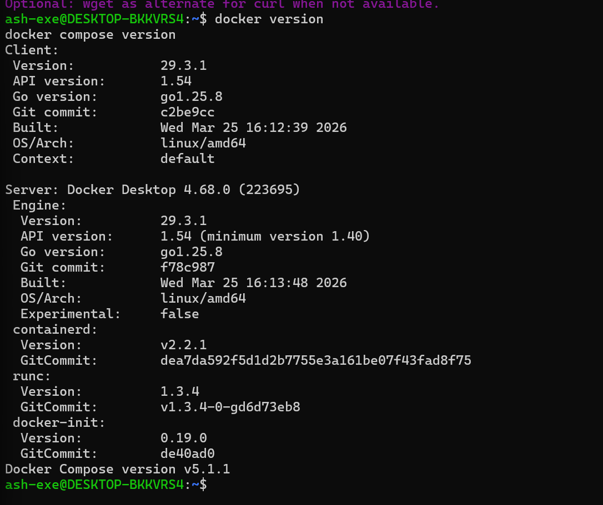

---

## 2. Create the Monitoring Workspace 📂

A dedicated monitoring workspace was created inside the Ubuntu WSL Linux filesystem.

### Tasks completed

1. created `~/monitoring`
2. created subfolders for:
   * Prometheus
   * Alertmanager
   * Blackbox Exporter
   * Grafana provisioning
   * Grafana dashboards

### Validation

* the directory structure existed under `~/monitoring`

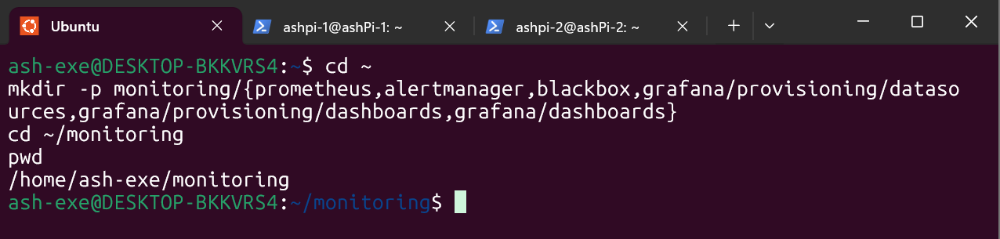

---

## 3. Create the Docker Compose Stack 🐳

The monitoring stack was defined in `docker-compose.yml`.

### Services deployed

* Prometheus
* Alertmanager
* Blackbox Exporter
* Grafana

### Design choices

* only Grafana was published to the host on port `3000`
* Prometheus, Alertmanager, and Blackbox remained internal-only
* Grafana used a local admin account with anonymous access disabled

### Validation

* all containers started successfully with `docker compose up -d`
* `docker compose ps` showed the services running

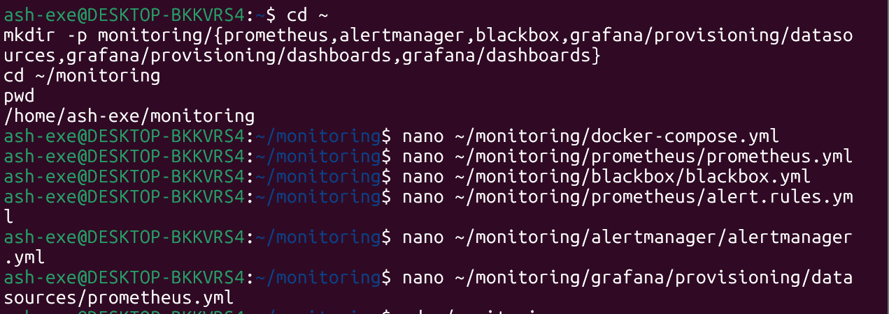
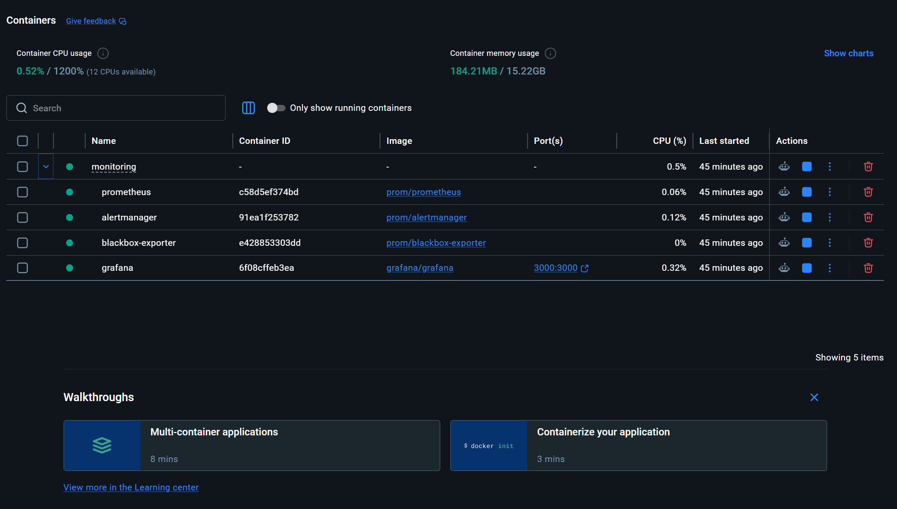

---

## 4. Configure Prometheus 📡

Prometheus was configured to scrape both host metrics and DNS probe targets.

### Scrape targets added

* Prometheus
* Alertmanager
* Blackbox Exporter
* `ashpi-1` Node Exporter — `192.168.68.60:9100`
* `ashpi-2` Node Exporter — `192.168.68.61:9100`
* HA DNS VIP probe — `192.168.68.20:53`
* `ashpi-1` direct DNS probe — `192.168.68.60:53`
* `ashpi-2` direct DNS probe — `192.168.68.61:53`

### Validation

* the `up` query returned healthy results for the configured scrape jobs
* the `probe_success` query returned healthy results for the DNS probe targets


---

## 5. Configure Blackbox Exporter 🌐

Blackbox Exporter was configured to perform DNS-based probes against the HA DNS service path.

### Probe type used

* UDP DNS probe
* query name: `google.com`
* query type: `A`
* recursion desired: `true`

### Validation

* `probe_success` returned `1` for:
  * the VIP
  * `ashpi-1`
  * `ashpi-2`


---

## 6. Install Node Exporter on ashpi-1 📈

Node Exporter was installed on `ashpi-1` to expose Linux host metrics.

### Tasks completed

1. created the `node_exporter` service account
2. downloaded the Node Exporter binary
3. copied it to `/usr/local/bin`
4. created the systemd service
5. enabled and started the service

### Validation

* `systemctl status node_exporter` showed the service as active
* `curl http://localhost:9100/metrics | head` returned metrics successfully

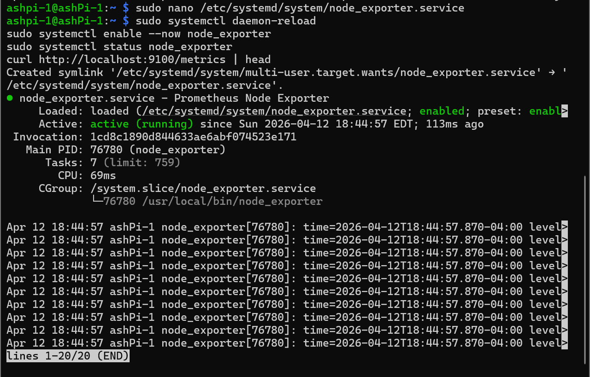
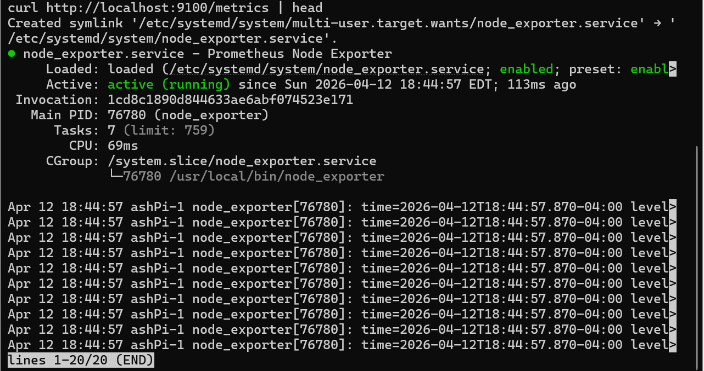

---

## 7. Install Node Exporter on ashpi-2 📈

The same Node Exporter process was repeated on `ashpi-2`.

### Validation

* `systemctl status node_exporter` showed the service as active
* `curl http://localhost:9100/metrics | head` returned metrics successfully

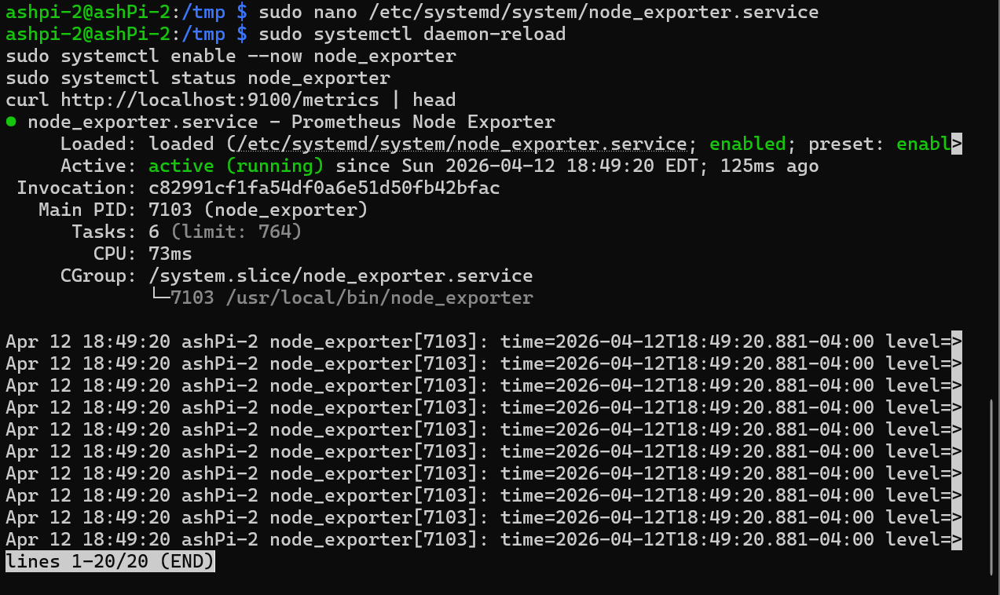

---

## 8. Provision Grafana and Confirm the Data Source 📊

Grafana was configured with Prometheus as the default data source.

### Tasks completed

1. started Grafana through Docker Compose
2. logged in with the local admin account
3. confirmed Prometheus was available as a data source
4. used Explore to validate live queries

### Validation queries used

```promql
up
```

```promql
probe_success
```

### Validation

* Grafana successfully returned live Prometheus data
* both dashboards could be built from the query results

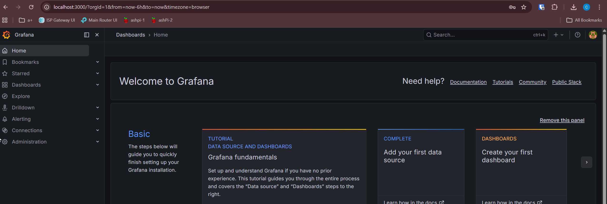
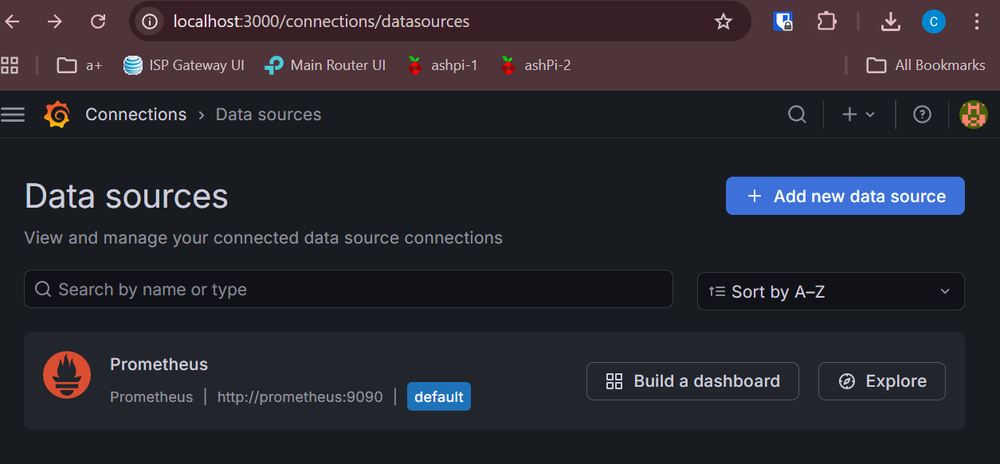


---

## 9. Build the Dashboards 📋

Two dashboards were created.

### Node Health

Panels included:

* Node Up
* CPU Used %
* Memory Used %
* Root Disk Free %
* Uptime

### DNS & Failover

Panels included:

* VIP DNS Success
* Per-node DNS Success
* VIP DNS Probe Duration
* Per-node DNS Probe Duration
* Active Alerts

### Validation

* both dashboards rendered correct data
* stat panels were adjusted to use:
  * Instant query mode
  * Last not null
* time-series panels showed historical trends correctly


---

## 10. Configure Alert Rules 🚨

Prometheus alert rules were added for:

* VIP DNS down
* single node down
* both nodes down
* VIP DNS latency high
* direct DNS node probe failure

### Design choices

* `for:` durations were used to reduce alert noise
* critical alerts were reserved for service-impact conditions
* healthy failover was not treated as a critical outage

### Validation

* alert rules loaded successfully
* `ALERTS` queries returned expected alert states


---

## 11. Validate Alert Lifecycle ✅

A single-node-down test was performed by stopping Node Exporter on `ashpi-2`.

### Validation steps

1. stopped Node Exporter on `ashpi-2`
2. observed alert move to pending
3. observed alert move to firing
4. restored Node Exporter
5. observed the alert clear

### Result

The alert lifecycle behaved as expected from pending → firing → cleared.


---

## 12. Validate Failover Monitoring 🔁

A keepalived failover test was performed to confirm monitoring reflected healthy failover correctly.

### Validation steps

1. identified the current VIP owner
2. stopped keepalived on the active node
3. confirmed the VIP moved to the standby node
4. confirmed VIP DNS probes remained healthy
5. confirmed no false critical outage alert fired
6. restored keepalived

### Result

Monitoring correctly reflected a healthy failover event without misclassifying it as a service outage.

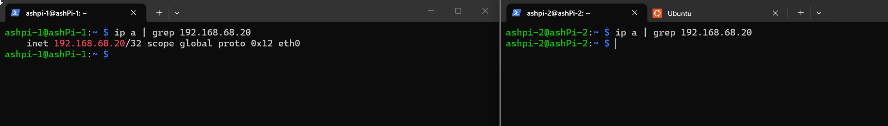

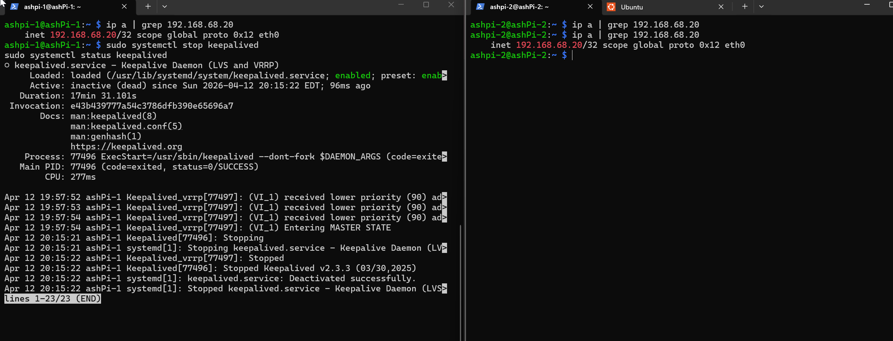
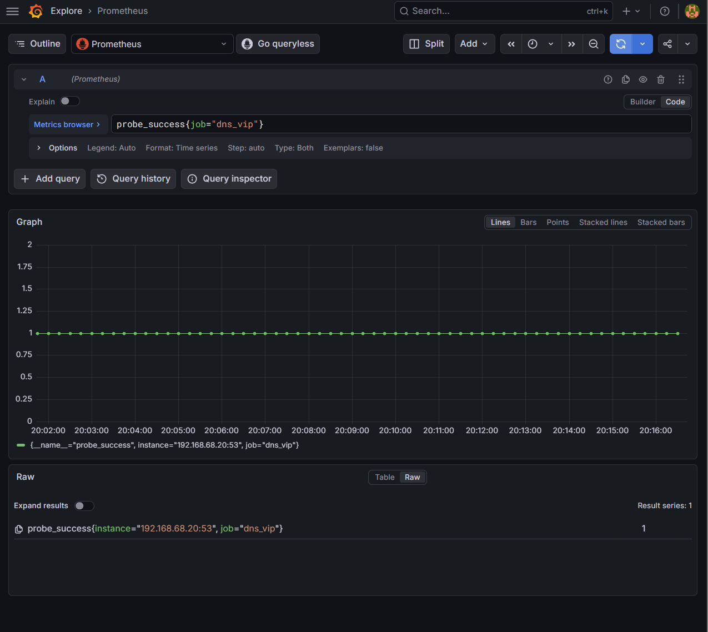
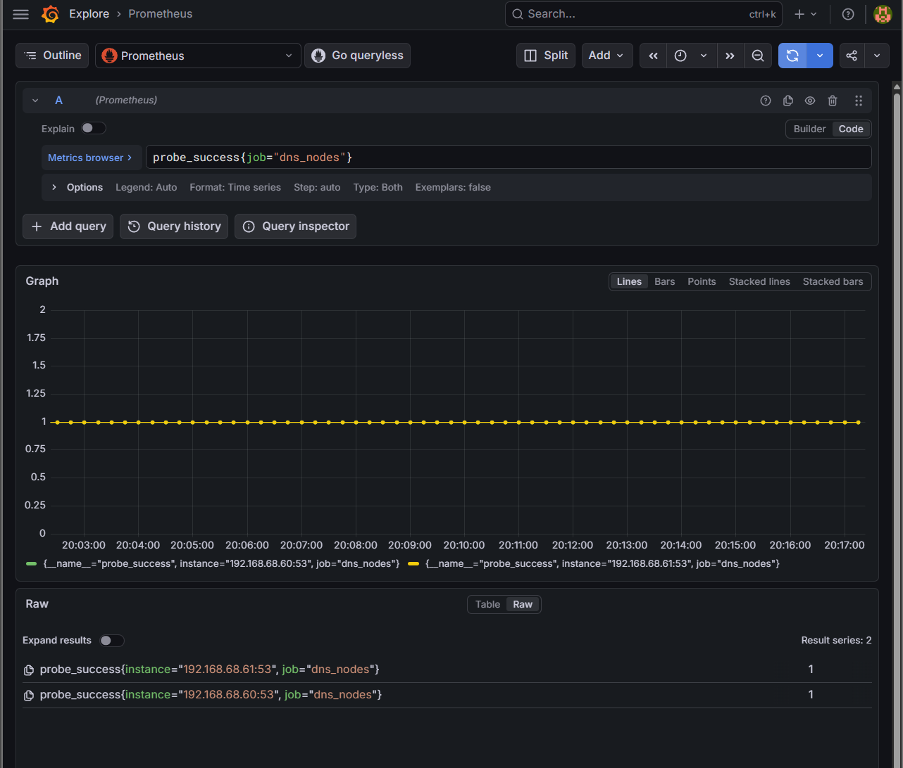


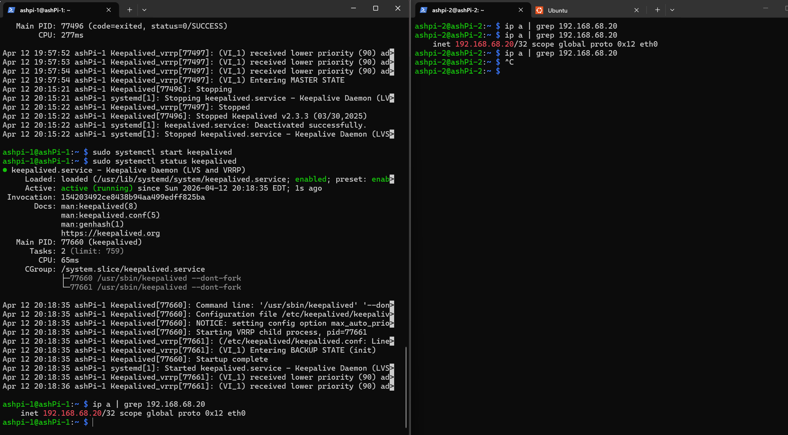

---

## 13. Back Up the Monitoring Configuration 💾

The monitoring configuration was archived from Ubuntu WSL.

### Validation

* backup archive was created successfully
* dashboard JSON exports were also saved for reuse

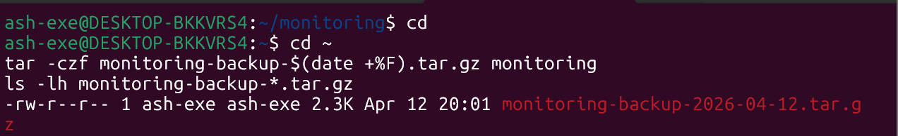

---

## 🏁 Result

Phase 4 completed the observability and alerting layer for the HA DNS environment by adding:

* host-level monitoring
* DNS path monitoring
* failover-aware dashboards
* service-impact-driven alerting
* validated alert lifecycle behavior
