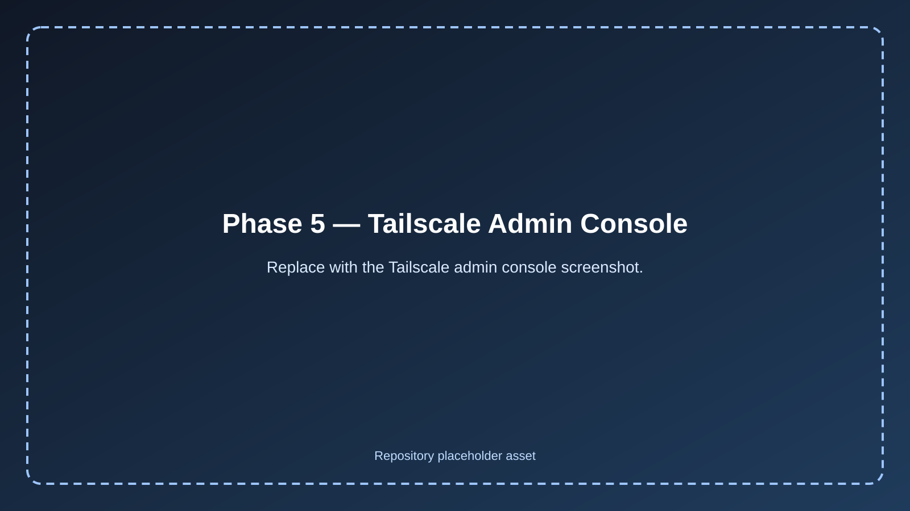

# Phase 5 — Remote Access Overview 🔐

## 📖 Overview

Phase 5 adds the **secure remote administration layer** to the homelab.

By the end of Phase 4, the environment already had:

* HA DNS with dual Pi-hole nodes
* Gravity Sync replication
* keepalived VIP failover
* Unbound recursive DNS on both nodes
* monitoring and alerting with Prometheus, Grafana, Alertmanager, and Blackbox Exporter
* validated failover and alert lifecycle behavior

Phase 5 builds on that by creating a **private remote admin path** into the environment without exposing SSH directly to the internet.

---

## 🎯 Objectives

The goals of this phase were to:

* establish secure remote access to both Raspberry Pi nodes
* avoid public SSH exposure
* avoid router port forwarding
* validate remote administration from outside the home network
* keep the implementation simple and reliable

---

## 🧱 Remote Access Design

Tailscale was used as the secure remote access platform for this phase.

The remote access path became:

* gaming PC → Tailscale → `ashpi-1`
* gaming PC → Tailscale → `ashpi-2`
* laptop → Tailscale → `ashpi-1`
* laptop → Tailscale → `ashpi-2`

This created a private remote path that did not require exposing SSH directly to the public internet.

---

## 🖥️ Devices Joined to the Tailnet

The following devices were added to the tailnet:

* gaming PC
* laptop
* `ashpi-1`
* `ashpi-2`

MagicDNS naming was used so the Raspberry Pi devices could be reached by clean hostnames.

---

## 🔐 Why Tailscale Was Chosen

Tailscale was chosen for Phase 5 because it provided:

* a fast secure remote access implementation
* free personal use support
* private tailnet connectivity
* MagicDNS-based device naming
* easy validation from both local and off-site networks

For this phase, standard SSH over Tailscale was used rather than adding more complex routing or access patterns immediately.

---

## 🛡️ Security Approach

The key security decisions for this phase were:

* no public SSH exposure
* no router port forwarding
* remote administration restricted to devices inside the tailnet
* direct SSH access only through the Tailscale private path

This kept the attack surface smaller while still enabling remote administration.

---

## ✅ Validation Summary

Phase 5 was validated by confirming:

* the gaming PC joined the tailnet successfully
* the laptop joined the tailnet successfully
* `ashpi-1` joined the tailnet successfully
* `ashpi-2` joined the tailnet successfully
* `tailscale ping` worked to both Pi nodes
* SSH worked to both Pi nodes over Tailscale
* remote SSH worked from outside the home network using a phone hotspot
* no public SSH port forwarding was needed

---

## 📸 Screenshot Asset Map

Phase 5 screenshot links now point to committed placeholder assets under [`../../screenshots/phase-5/`](../../screenshots/phase-5/README.md).

Replace each placeholder with the real screenshot while keeping the same filename.

---

## 🏁 Outcome

Phase 5 completed the secure remote admin layer of the project.

At the end of this phase, the homelab had:

* secure private remote administration
* SSH access to both Raspberry Pi nodes from inside and outside the home network
* no reliance on public SSH exposure
* a cleaner and safer operational model for remote management

---

## 🚀 Next Step

With the first five phases complete, the next major area of growth is:

* managed switching
* VLANs and segmentation
* stronger network separation
* migration of monitoring to a dedicated always-on host
* deeper infrastructure services on future workstation / Proxmox hardware
