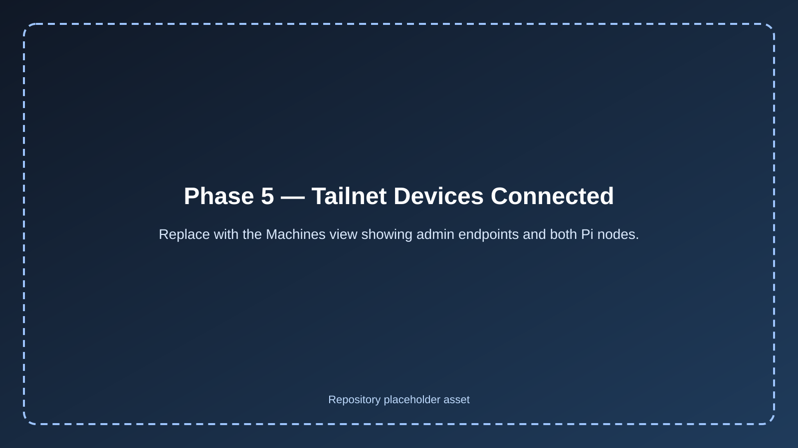
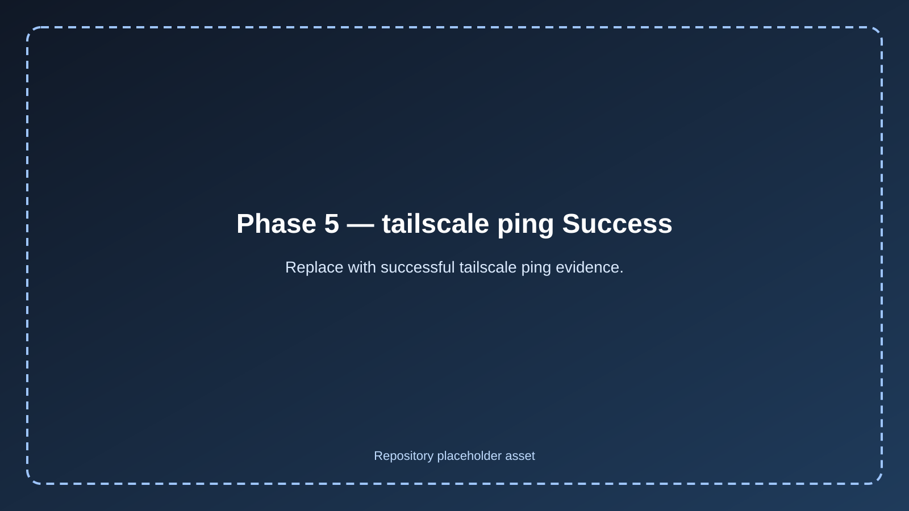
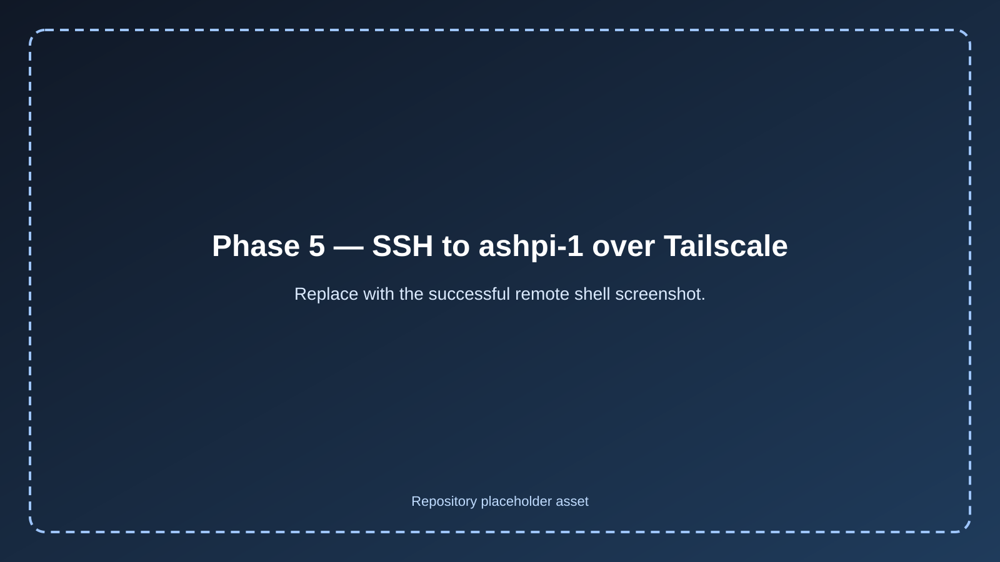
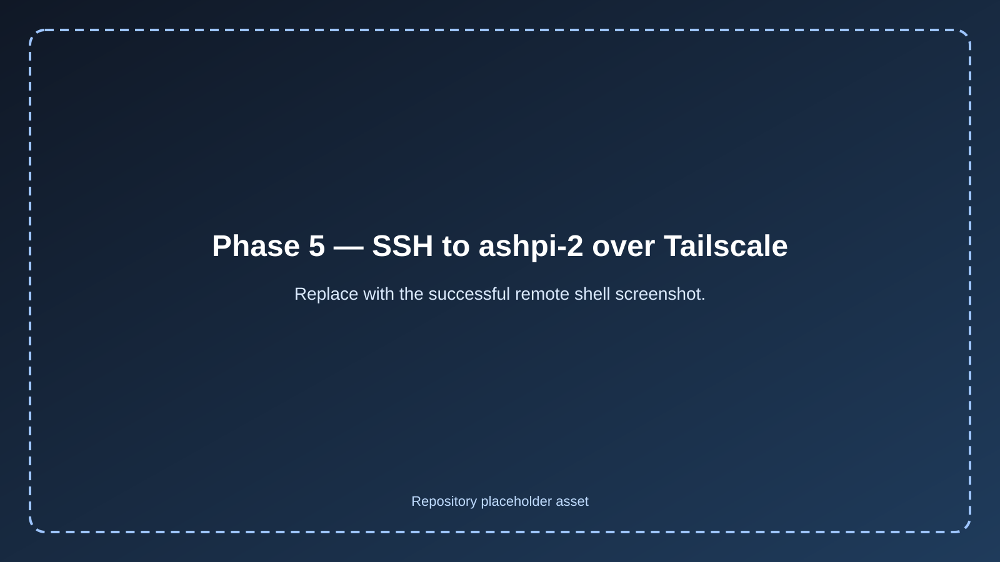

# Phase 5 — Validation 🧪

## 📖 Purpose

This document captures the validation steps used to confirm that secure remote access works correctly for the homelab.

The validation process focused on:

* successful device enrollment into the tailnet
* successful tailnet connectivity to both Raspberry Pi nodes
* successful SSH over Tailscale
* successful off-site remote administration

---

## Validation 1 — Tailnet Enrollment 🌐

### Validation performed

Confirmed the following devices successfully joined the tailnet:

* gaming PC
* laptop
* `ashpi-1`
* `ashpi-2`

### Result

Passed ✅



---

## Validation 2 — Tailnet Connectivity 📡

### Validation commands

```bash
tailscale ping ashpi-1
tailscale ping ashpi-2
```

### Expected result

Both Raspberry Pi nodes should respond successfully inside the tailnet.

### Result

Passed ✅

Both Pi nodes returned successful `tailscale ping` responses.



---

## Validation 3 — SSH to ashpi-1 🔐

### Validation command

```bash
ssh your-user@ashpi-1
```

### Expected result

A successful remote shell session should open to `ashpi-1`.

### Verification commands run after login

```bash
hostname
ip a
```

### Result

Passed ✅

SSH to `ashpi-1` over Tailscale succeeded.



---

## Validation 4 — SSH to ashpi-2 🔐

### Validation command

```bash
ssh your-user@ashpi-2
```

### Expected result

A successful remote shell session should open to `ashpi-2`.

### Verification commands run after login

```bash
hostname
ip a
```

### Result

Passed ✅

SSH to `ashpi-2` over Tailscale succeeded.



---

## Validation 5 — Off-Site Remote Access 📶

### Validation performed

Moved the admin endpoint off the home network using a phone hotspot, then repeated remote access testing.

### Expected result

The admin endpoint should remain connected to the tailnet and still be able to SSH into both Raspberry Pi nodes.

### Result

Passed ✅

Remote SSH access to the Pi nodes worked successfully from outside the home network.


---

## Validation 6 — No Public SSH Exposure 🚫

### Validation performed

Confirmed that the secure remote access design did not require public SSH port forwarding.

### Expected result

Remote administration should work through Tailscale only.

### Result

Passed ✅

The homelab remained remotely manageable without exposing SSH directly to the public internet.

---

## 🏁 Conclusion

Phase 5 validation confirmed that the homelab now has:

* working secure remote access
* private SSH administration through Tailscale
* successful off-site access to both Raspberry Pi nodes
* no need for public SSH exposure or router port forwarding

This completes the secure remote access phase of the project.
