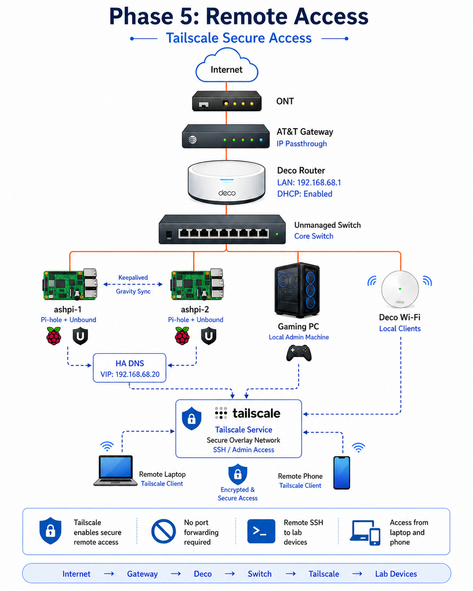

# Phase 5 — Tailscale Remote Access 🔐


---

## Phase Summary

Phase 5 added secure remote administration with Tailscale.

This phase allowed private access to internal infrastructure without exposing SSH, dashboards, or management services directly to the public internet.

---

## What This Phase Demonstrates

| Area | Demonstrated Skill |
|---|---|
| Secure remote access | Private overlay networking with Tailscale |
| Admin workflows | Remote SSH to infrastructure nodes |
| Mobile validation | Access tested from phone/admin endpoint |
| Reduced exposure | Avoided public port forwarding |
| Documentation | Remote access validation and notes |

---

## Remote Access Flow

```text
Laptop / Phone / Admin Endpoint
  ↓
Tailscale Tailnet
  ↓
Internal Infrastructure
  ├── Raspberry Pi Nodes
  ├── Proxmox Host
  ├── Monitoring Services
  └── Core Lab Systems
```



---

## Phase Documentation

| Page | Description |
|---|---|
| [Overview](./overview.md) | Tailscale remote access case study |
| [Step-by-Step Guide](./step-by-step.md) | Implementation flow |
| [Validation](./validation.md) | Remote access validation evidence |

---

## Outcome

The lab could be managed remotely without relying on public inbound port forwarding.
