# Phase 5: Step-by-Step Guide 🛠️

---

## Quick Navigation

| Page | Link |
|---|---|
| Phase Home | [README](README.md) |
| Overview | [overview.md](overview.md) |
| Step-by-Step Guide | [step-by-step.md](step-by-step.md) |
| Validation | [validation.md](validation.md) |
| Documentation Hub | [docs/](../README.md) |

---


## 📖 Purpose

This guide documents the implementation of secure remote access for the homelab using Tailscale.

Phase 5 builds on the completed HA DNS and monitoring stack and adds:

- secure remote connectivity
- private tailnet-based device access
- SSH administration over Tailscale
- off-site administration without router port forwarding

---

## ✅ Prerequisites

Before starting Phase 5, the following were already complete:

- HA DNS with dual Pi-hole nodes
- monitoring and alerting with Prometheus and Grafana
- Alertmanager Discord notifications
- local SSH access to both Pi nodes on the home network
- Windows desktop and laptop available as remote admin endpoints
- Tailscale account created

---

## 1. Create the Tailscale Tailnet 🌐

Tailscale was selected as the Phase 5 remote access platform.

### Tasks completed

1. created or signed in to a Tailscale account
2. allowed Tailscale to create the private tailnet
3. opened the Tailscale admin console
4. prepared the first device for enrollment

### Validation

- admin console loaded successfully
- tailnet was available for device enrollment
- Tailscale prompted to add the first device

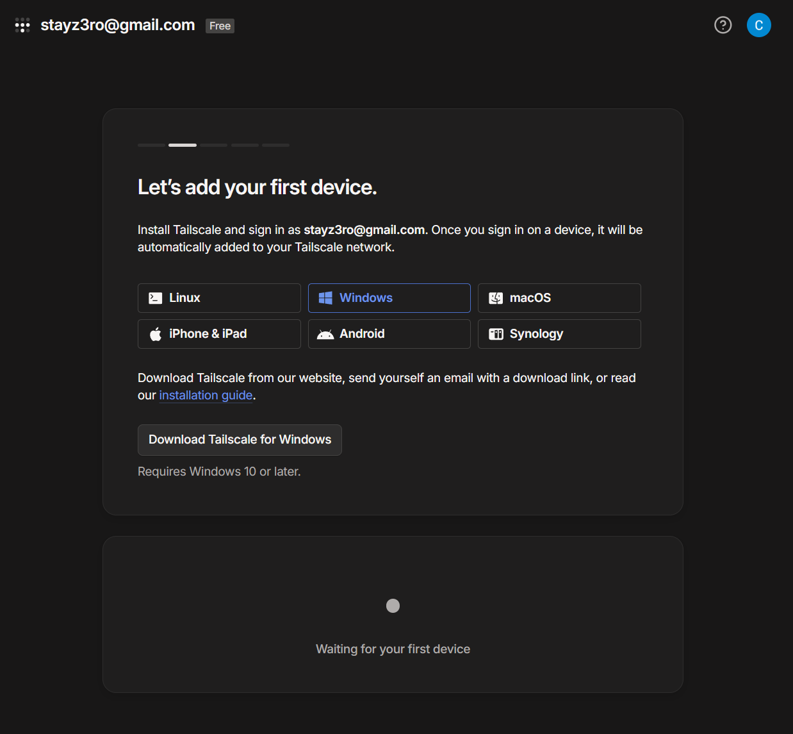

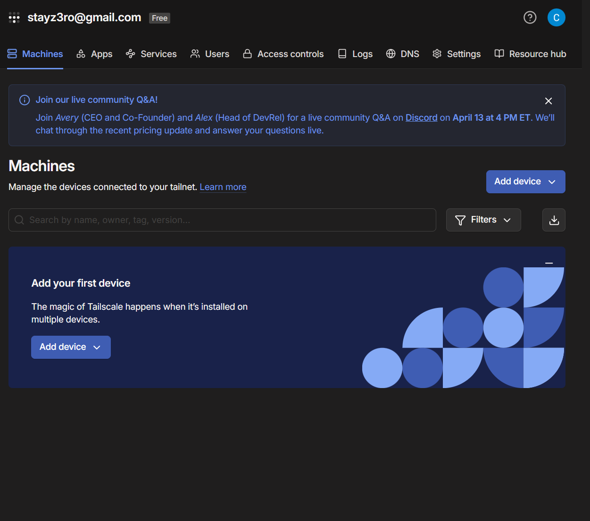

---

## 2. Add the Windows Desktop 💻

The Windows desktop was added to the tailnet first.

### Tasks completed

1. installed Tailscale on the Windows desktop
2. signed in with the same Tailscale account
3. confirmed the device appeared in the Machines list

### Validation

- Windows desktop successfully joined the tailnet
- Tailscale assigned the device a private tailnet address

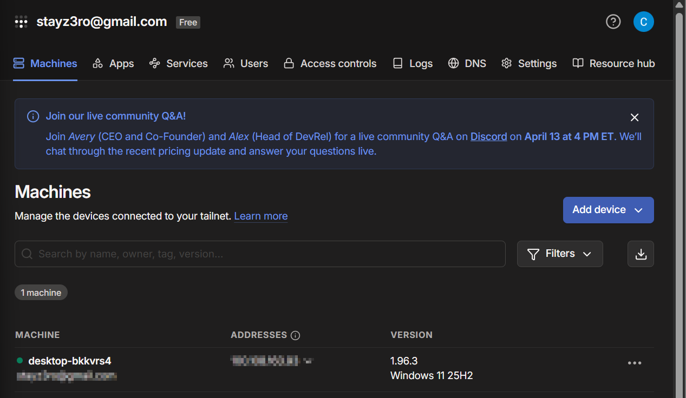

---

## 3. Add the Second Windows Admin Device 🖥️

A second Windows device was added as another admin endpoint.

### Tasks completed

1. installed Tailscale on the second Windows device
2. signed in with the same Tailscale account
3. confirmed the device appeared in the Machines list

### Validation

- second Windows device successfully joined the tailnet
- both Windows admin devices appeared in the Tailscale console

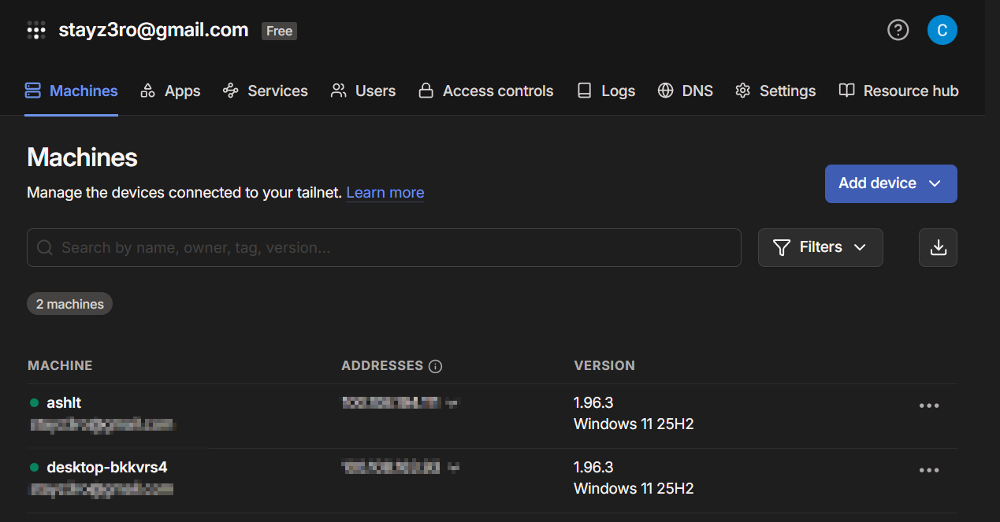

---

## 4. Install Tailscale on ashpi-1 📡

Tailscale was installed on `ashpi-1`.

### Tasks completed

1. SSH’d locally into `ashpi-1`
2. installed Tailscale using the Linux install script
3. ran `sudo tailscale up`
4. authenticated the device through the Tailscale login link
5. confirmed the device appeared in the Tailscale admin console

### Validation commands

```bash
tailscale ip
tailscale status
hostname
```

### Validation

- `ashpi-1` joined the tailnet successfully
- `ashpi-1` received a Tailscale IP address
- `ashpi-1` appeared in `tailscale status`
- `ashpi-1` appeared in the admin console

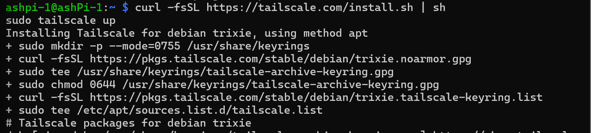

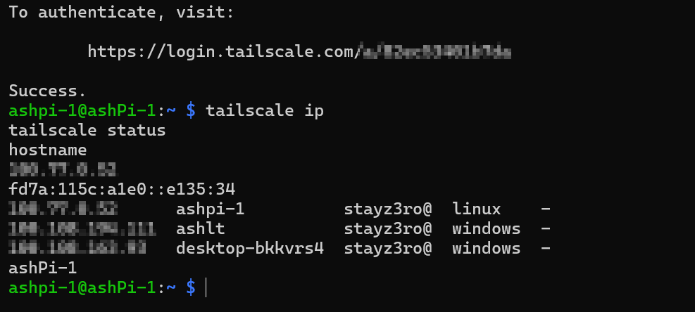

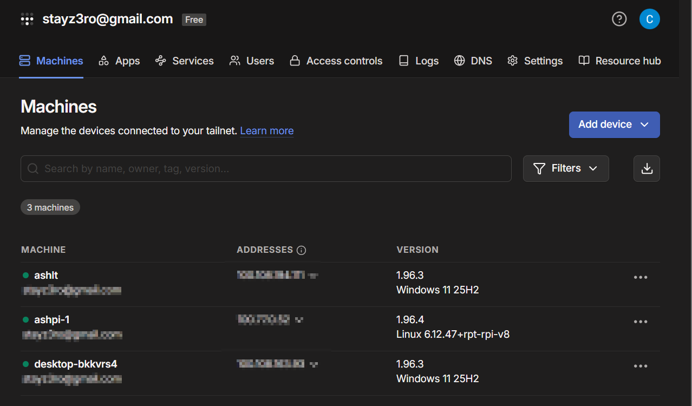

---

## 5. Install Tailscale on ashpi-2 📡

The same Tailscale process was repeated on `ashpi-2`.

### Tasks completed

1. SSH’d locally into `ashpi-2`
2. installed Tailscale using the Linux install script
3. ran `sudo tailscale up`
4. authenticated the device through the Tailscale login link
5. confirmed the device appeared in the Tailscale admin console

### Validation commands

```bash
tailscale ip
tailscale status
hostname
```

### Validation

- `ashpi-2` joined the tailnet successfully
- `ashpi-2` received a Tailscale IP address
- `ashpi-2` appeared in `tailscale status`
- `ashpi-2` appeared in the admin console

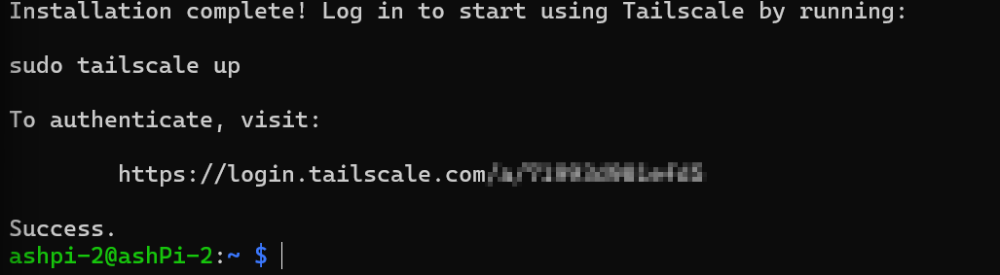

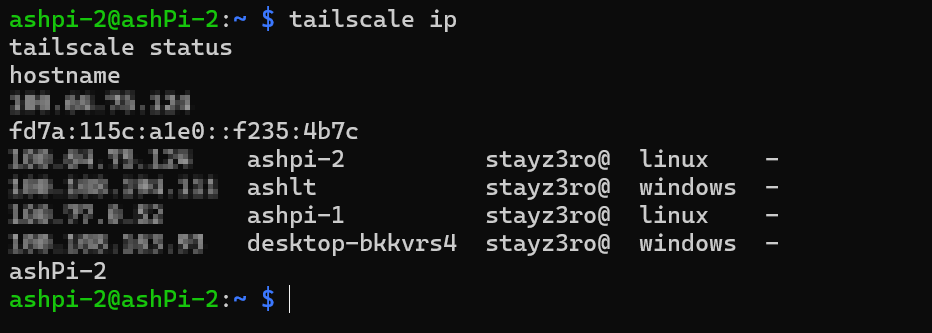

---

## 6. Confirm All Core Devices in the Tailnet ✅

After both Raspberry Pi nodes were added, the Tailscale admin console showed the core devices in the tailnet.

### Devices visible

- Windows desktop
- second Windows admin device
- `ashpi-1`
- `ashpi-2`

### Validation

- all expected devices appeared in the Tailscale Machines list
- each device had a Tailscale IP address
- both Pi nodes were online

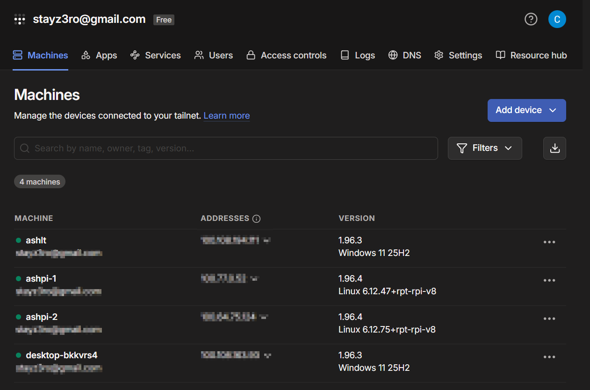

---

## 7. Enable Tailscale SSH on Both Pi Nodes 🔐

Tailscale SSH was enabled on both Raspberry Pi nodes.

### Commands used

On `ashpi-1`:

```bash
sudo tailscale set --ssh
```

On `ashpi-2`:

```bash
sudo tailscale set --ssh
```

### Validation

- command completed successfully on `ashpi-1`
- command completed successfully on `ashpi-2`
- both nodes were prepared for SSH access through the tailnet

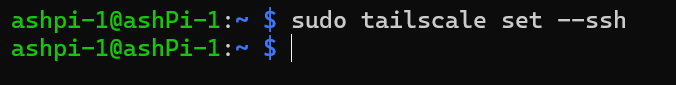

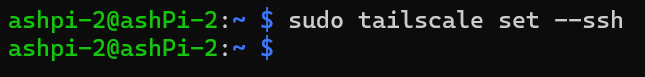

---

## 8. Confirm SSH Service on Both Pi Nodes 🧪

The local SSH service was checked on both Raspberry Pi nodes.

### Commands used

```bash
sudo systemctl status ssh
```

### Validation

- SSH service was enabled on `ashpi-1`
- SSH service was active and running on `ashpi-1`
- SSH service was enabled on `ashpi-2`
- SSH service was active and running on `ashpi-2`

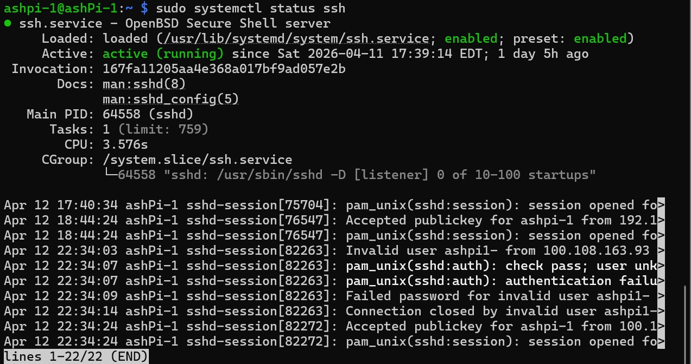

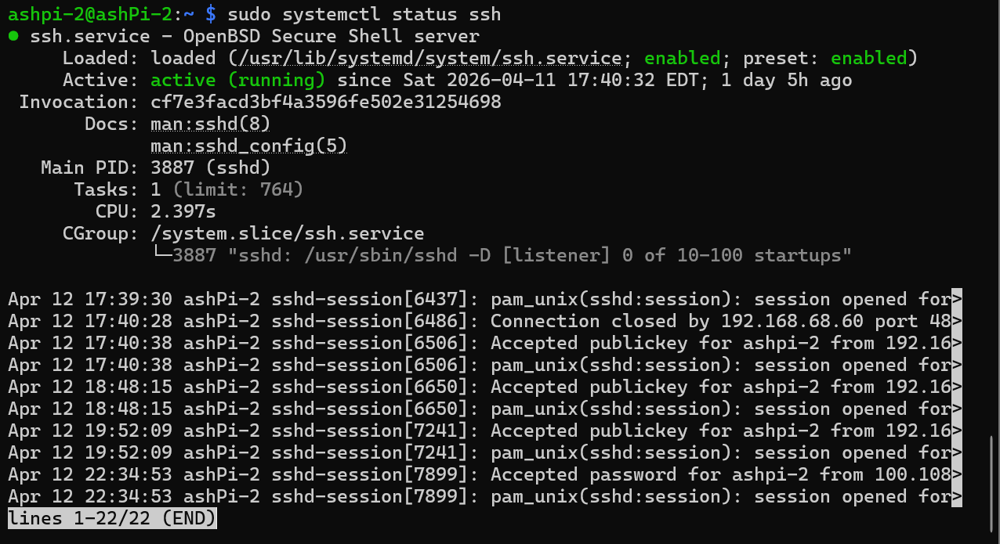

---

## 9. Test Tailnet Connectivity from the Admin Device 📡

Basic connectivity was tested from the admin endpoint.

### Validation commands

```bash
tailscale ping ashpi-1
tailscale ping ashpi-2
```

### Implementation note

During testing, running `tailscale` commands from Ubuntu WSL on the Windows admin machine showed a separate unauthenticated Tailscale context.

The cleaner approach was to use the Windows Tailscale client as the authenticated admin endpoint instead of trying to manage a separate WSL Tailscale identity.

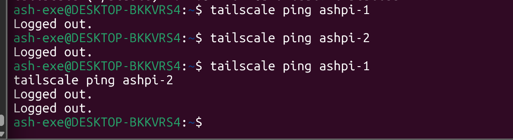

---

## 10. Validate Remote Administration Model 📶

The final validation confirmed that remote administration could be performed through the private Tailscale path instead of public SSH exposure.

### Result

- admin endpoints were inside the tailnet
- both Pi nodes were inside the tailnet
- SSH services were active on both Pi nodes
- no router port forwarding was required
- no public SSH exposure was needed

---

## 🏁 Result

Phase 5 completed the secure remote access layer for the homelab by adding:

- private tailnet-based connectivity
- both Raspberry Pi nodes added to Tailscale
- both admin endpoints added to Tailscale
- SSH service validation on both Pi nodes
- Tailscale SSH enabled on both Pi nodes
- a remote admin path that does not depend on public SSH exposure
