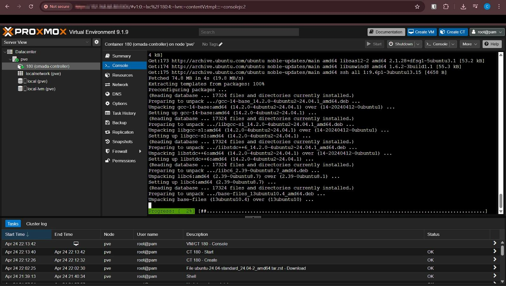

# Phase 6 — Screenshot Evidence

## Purpose

This document tracks the screenshots used to validate Phase 6: Proxmox Infrastructure & Omada Network Foundation.

Phase 6 focused on:

- deploying Proxmox on the OptiPlex host
- creating an Omada Controller LXC
- preparing the ER605 router for network cutover
- migrating the monitoring stack from the gaming PC to an Ubuntu Docker VM
- validating that the gaming PC is no longer required for always-on monitoring

---

## Screenshot Index

| # | Screenshot | Purpose |
|---:|---|---|
| 1 | `01-omada-lxc-package-install.jpeg` | Shows Omada Controller package installation inside the LXC |
| 2 | `02-proxmox-storage-layout.png` | Shows Proxmox storage layout |
| 3 | `03-proxmox-node-summary.png` | Shows Proxmox host health, CPU, RAM, and disk usage |
| 4 | `04-omada-controller-dashboard.png` | Shows Omada Controller running and accessible |
| 5 | `05-er605-address-reservations.png` | Shows static reservations for core infrastructure devices |
| 6 | `06-er605-lan-dhcp-pihole-dns.png` | Shows ER605 LAN, DHCP range, and Pi-hole VIP DNS configuration |
| 7 | `07-docker-vm-summary.png` | Shows the Ubuntu Docker VM running in Proxmox |
| 8 | `08-docker-compose-monitoring-running.png` | Shows Grafana, Prometheus, Alertmanager, and Blackbox Exporter running |
| 9 | `09-grafana-running-from-docker-vm.png` | Shows Grafana accessible from the new VM IP |
| 10 | `10-proxmox-backup-to-hdd-storage.png` | Shows backup/recovery validation using hdd-storage |
| 11 | `11-gaming-pc-docker-stopped.png` | Shows the gaming PC is no longer running the monitoring stack |

---

## 01 — Omada LXC Package Installation

This screenshot shows the Omada Controller being installed inside an LXC container on Proxmox.

---

## 02 — Proxmox Storage Layout

This screenshot shows the Proxmox storage configuration used for active workloads and backups.

---

## 03 — Proxmox Node Summary

This screenshot validates the Proxmox host is online and healthy.

---

## 04 — Omada Controller Dashboard

This screenshot shows the Omada Controller accessible from the LAN.

---

## 05 — ER605 Address Reservations

This screenshot shows DHCP reservations for core infrastructure devices.

> Note: MAC addresses should be blurred before publishing publicly.

---

## 06 — ER605 LAN, DHCP, and Pi-hole DNS

This screenshot shows the ER605 preconfigured with:

- LAN IP: `192.168.68.1`
- DHCP range: `192.168.68.100-192.168.68.200`
- Primary DNS: `192.168.68.20`

---

## 07 — Docker VM Summary

This screenshot shows the Ubuntu Docker VM running inside Proxmox.

---

## 08 — Docker Compose Monitoring Stack Running

This screenshot validates that the monitoring containers are running on the Ubuntu Docker VM.

---

## 09 — Grafana Running from Docker VM

This screenshot validates that Grafana is accessible from the Proxmox-hosted Docker VM.

---

## 10 — Proxmox Backup to hdd-storage

This screenshot validates that VM/LXC backups are stored on the dedicated HDD storage target.

---

## 11 — Gaming PC Docker Stopped

This screenshot validates that the gaming PC is no longer required to run the monitoring stack.

---

## Redaction Notes

Before publishing screenshots publicly, blur or crop:

- MAC addresses
- public IP addresses
- API keys, tokens, or secrets
- Discord webhook URLs
- cloud account identifiers
- personal browser bookmarks if desired
