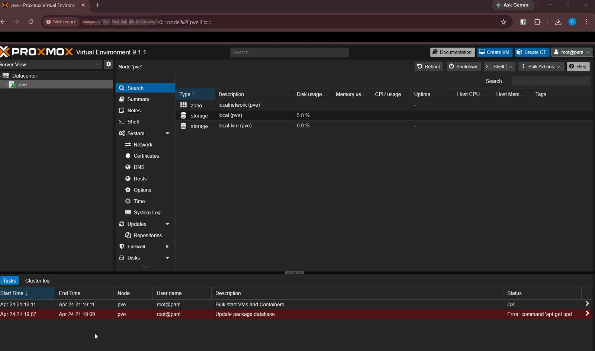

# Phase 6 Step-by-Step — Proxmox Infrastructure & Omada Network Foundation

## Overview

This guide documents the steps used to build the Phase 6 infrastructure layer.

Phase 6 included:

- setting up Proxmox on the OptiPlex
- configuring storage for active workloads and backups
- deploying the Omada Controller in an LXC
- preconfiguring the ER605 router
- creating an Ubuntu Docker VM
- migrating the monitoring stack from the gaming PC to Proxmox
- validating Grafana from the new VM IP
- confirming the gaming PC is no longer required for monitoring

---

## Step 1 — Install Proxmox on the OptiPlex

Proxmox was installed on the Dell OptiPlex to act as the dedicated virtualization host for the lab.

### Proxmox Host Settings

| Setting | Value |
|---|---|
| Hostname | `pve` |
| Management IP | `192.168.68.80` |
| Gateway | `192.168.68.1` |
| DNS | `192.168.68.20` |
| Role | Virtualization and services host |

### Validation

Proxmox was reachable from the browser:

```text
https://192.168.68.80:8006
```


---

## Step 2 — Review and Adjust Proxmox Storage

The Proxmox storage layout was reviewed to separate active workloads from backup/support storage.

### Storage Purpose

| Storage | Purpose |
|---|---|
| `local` / `local-lvm` | Active VMs and containers |
| `hdd-storage` | Backups, ISO images, templates, archives |

### Validation



---

## Step 3 — Create the Omada Controller LXC

An LXC container was created for the Omada Software Controller.

### Container Purpose

The Omada Controller provides centralized management for Omada network devices without requiring a hardware controller.

### Controller Details

| Setting | Value |
|---|---|
| Type | LXC |
| Service | Omada Software Controller |
| IP Address | `192.168.68.62` |
| Gateway | `192.168.68.1` |
| DNS | `192.168.68.20` |
| URL | `https://192.168.68.62:8043` |

### Validation

The Omada Controller package installation was completed inside the LXC.


The Omada Controller dashboard was then reachable from the LAN.


---

## Step 4 — Preconfigure the ER605 Router

The ER605 was configured before being placed into the live network path.

The goal was to preserve the current network and avoid changing the Pi-hole HA DNS design.

### LAN Configuration

| Setting | Value |
|---|---|
| LAN IP | `192.168.68.1` |
| Subnet Mask | `255.255.255.0` |
| DHCP Server | Enabled |
| DHCP Start | `192.168.68.100` |
| DHCP End | `192.168.68.200` |
| Primary DNS | `192.168.68.20` |

### DHCP Reservations

Static reservations were created for core infrastructure devices.

| Device | IP Address |
|---|---:|
| Omada Controller | `192.168.68.62` |
| ashPi-1 | `192.168.68.60` |
| ashPi-2 | `192.168.68.61` |
| Proxmox Host | `192.168.68.80` |

### Validation


---

## Step 5 — Create the Ubuntu Docker VM

An Ubuntu VM was created in Proxmox to host the monitoring stack.

### VM Configuration

| Setting | Value |
|---|---|
| VM Name | `docker-services` |
| OS | Ubuntu Server |
| IP Address | `192.168.68.81` |
| Gateway | `192.168.68.1` |
| DNS | `192.168.68.20` |
| Purpose | Docker monitoring services |

### Validation


---

## Step 6 — Install Docker on the Ubuntu VM

Docker Engine and Docker Compose were installed on the Ubuntu VM.

### Commands Used

```bash
sudo apt update && sudo apt upgrade -y
sudo apt install -y ca-certificates curl gnupg git
curl -fsSL https://get.docker.com | sudo sh
sudo usermod -aG docker $USER
newgrp docker
```

### Validation Commands

```bash
docker --version
docker compose version
docker run hello-world
```

---

## Step 7 — Identify the Existing Docker Stack on the Gaming PC

On the gaming PC, the existing monitoring stack was identified.

### Commands Used

```bash
docker ps
docker compose ls
docker volume ls
```

### Existing Stack Location

```text
/home/ash-exe/monitoring/docker-compose.yml
```

### Existing Containers

```text
grafana
prometheus
alertmanager
blackbox-exporter
```

### Existing Docker Volumes

```text
monitoring_grafana_data
monitoring_prometheus_data
monitoring_alertmanager_data
```

---

## Step 8 — Stop the Monitoring Stack on the Gaming PC

The monitoring stack was stopped before backing up the files and volumes.

```bash
cd /home/ash-exe/monitoring
docker compose down
```

This ensured the Grafana and Prometheus data was not actively being written during backup.

---

## Step 9 — Back Up the Compose Files

A backup folder was created on the gaming PC.

```bash
cd /home/ash-exe
mkdir -p docker-migration/docker-volume-backups
tar czf docker-migration/monitoring-stack-files.tar.gz monitoring/
```

This backed up the Compose file and project configuration folders.

---

## Step 10 — Back Up Docker Volumes

The named Docker volumes were backed up using temporary Alpine containers.

### Grafana Volume

```bash
docker run --rm \
  -v monitoring_grafana_data:/volume:ro \
  -v /home/ash-exe/docker-migration/docker-volume-backups:/backup \
  alpine \
  sh -c "tar czf /backup/monitoring_grafana_data.tar.gz -C /volume ."
```

### Prometheus Volume

```bash
docker run --rm \
  -v monitoring_prometheus_data:/volume:ro \
  -v /home/ash-exe/docker-migration/docker-volume-backups:/backup \
  alpine \
  sh -c "tar czf /backup/monitoring_prometheus_data.tar.gz -C /volume ."
```

### Alertmanager Volume

```bash
docker run --rm \
  -v monitoring_alertmanager_data:/volume:ro \
  -v /home/ash-exe/docker-migration/docker-volume-backups:/backup \
  alpine \
  sh -c "tar czf /backup/monitoring_alertmanager_data.tar.gz -C /volume ."
```

---

## Step 11 — Copy Backups to the Ubuntu Docker VM

The Compose backup and volume backups were copied from the gaming PC to the Ubuntu Docker VM.

```bash
scp /home/ash-exe/docker-migration/monitoring-stack-files.tar.gz ash@192.168.68.81:/home/ash/
scp -r /home/ash-exe/docker-migration/docker-volume-backups ash@192.168.68.81:/home/ash/
```

---

## Step 12 — Restore Files on the Ubuntu Docker VM

On the Ubuntu Docker VM:

```bash
ssh ash@192.168.68.81

mkdir -p /home/ash/docker
mv /home/ash/monitoring-stack-files.tar.gz /home/ash/docker/
mv /home/ash/docker-volume-backups /home/ash/docker/
cd /home/ash/docker

tar xzf monitoring-stack-files.tar.gz
cd /home/ash/docker/monitoring
```

---

## Step 13 — Recreate Docker Volumes on the Ubuntu VM

```bash
docker volume create monitoring_grafana_data
docker volume create monitoring_prometheus_data
docker volume create monitoring_alertmanager_data
```

---

## Step 14 — Restore Docker Volume Data

### Grafana

```bash
docker run --rm \
  -v monitoring_grafana_data:/volume \
  -v /home/ash/docker/docker-volume-backups:/backup \
  alpine \
  sh -c "tar xzf /backup/monitoring_grafana_data.tar.gz -C /volume"
```

### Prometheus

```bash
docker run --rm \
  -v monitoring_prometheus_data:/volume \
  -v /home/ash/docker/docker-volume-backups:/backup \
  alpine \
  sh -c "tar xzf /backup/monitoring_prometheus_data.tar.gz -C /volume"
```

### Alertmanager

```bash
docker run --rm \
  -v monitoring_alertmanager_data:/volume \
  -v /home/ash/docker/docker-volume-backups:/backup \
  alpine \
  sh -c "tar xzf /backup/monitoring_alertmanager_data.tar.gz -C /volume"
```

---

## Step 15 — Start the Monitoring Stack on the Ubuntu VM

```bash
cd /home/ash/docker/monitoring
docker compose pull
docker compose up -d
docker compose ps
```

### Validation


---

## Step 16 — Validate Grafana from the New VM IP

Grafana was tested from the new Docker VM IP.

```text
http://192.168.68.81:3000
```

### Validation


---

## Step 17 — Confirm Gaming PC Docker Stack Is Stopped

On the gaming PC:

```bash
cd /home/ash-exe/monitoring
docker compose down
docker ps
```

The old monitoring stack was no longer required on the gaming PC.

### Validation


---

## Step 18 — Back Up the Docker VM and Omada LXC

Proxmox backups were created and stored on `hdd-storage`.

Recommended backup targets:

- Omada Controller LXC
- Ubuntu Docker VM

Recommended backup mode:

| Mode | Use |
|---|---|
| Snapshot | Less downtime |
| Stop | Cleaner backup |

### Validation


---

## Final State

```text
Proxmox Host - 192.168.68.80
├── Omada Controller LXC - 192.168.68.62
│   └── Omada Software Controller
│
└── Ubuntu Docker VM - 192.168.68.81
    ├── Grafana
    ├── Prometheus
    ├── Alertmanager
    └── Blackbox Exporter
```

## Next Steps

The next phase will move the ER605 into the live routing path.

Planned tasks:

- Connect ER605 between the ISP gateway and LAN
- Move DHCP/routing from Deco to ER605
- Switch Deco mesh into AP mode
- Validate internet access
- Validate DHCP leases
- Validate Pi-hole DNS through the VIP
- Add managed switch later
- Build VLAN segmentation in a future phase
