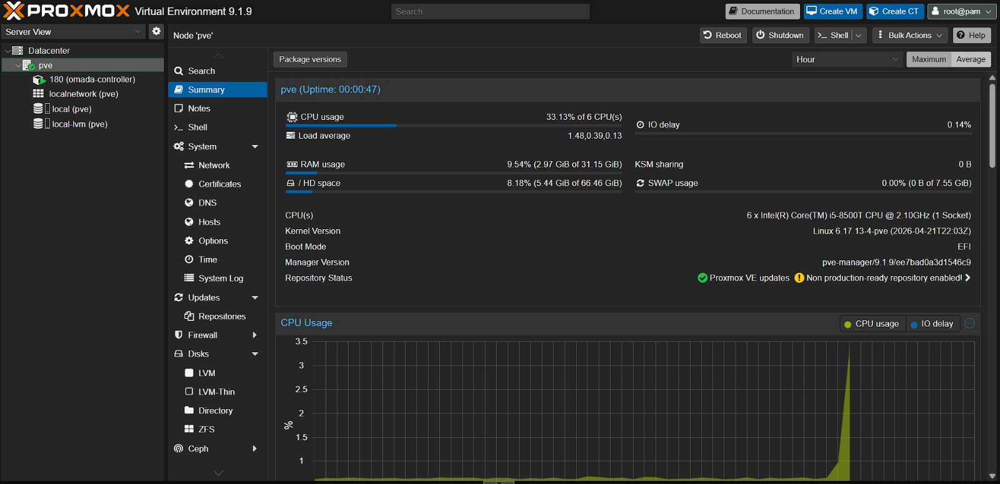
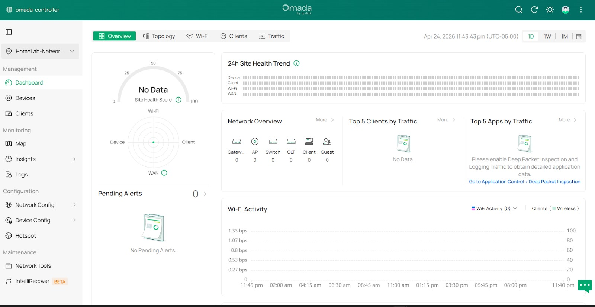
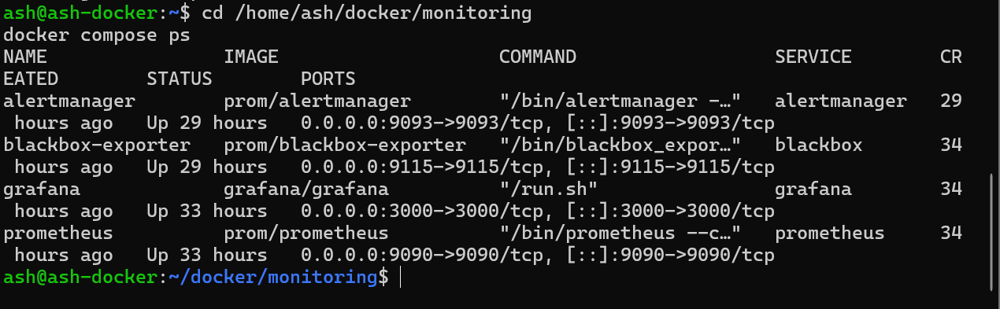
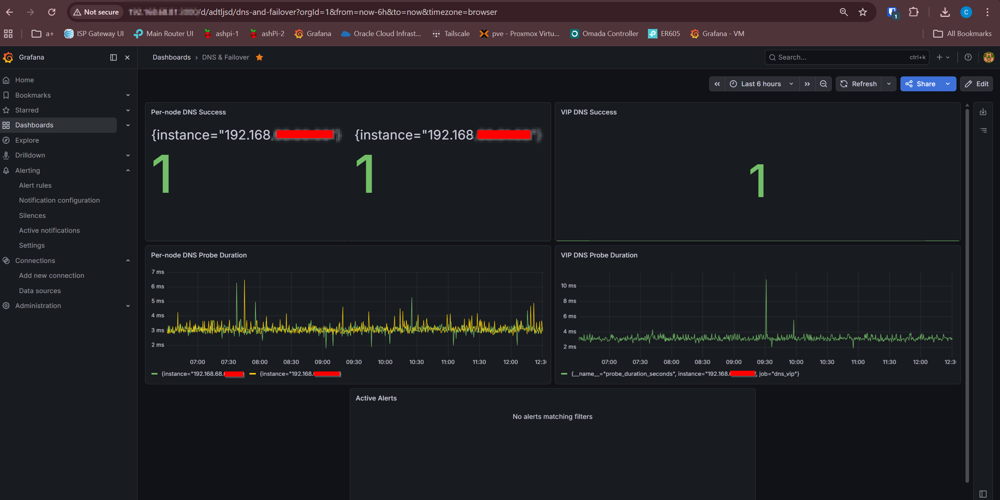

# Phase 6 — Proxmox Infrastructure & Omada Network Foundation

## Overview

Phase 6 adds a dedicated infrastructure layer to the home network lab using a Dell OptiPlex running Proxmox.

This phase moves always-on services away from a gaming PC and onto a dedicated virtualization host. It also introduces the Omada Software Controller and prepares the ER605 router for the next network cutover.

## What This Phase Includes

- Installed and configured Proxmox on a Dell OptiPlex
- Assigned the Proxmox host a static IP: `192.168.68.80`
- Created an Omada Controller LXC
- Hosted the Omada Controller at `192.168.68.10`
- Preconfigured the ER605 router for the existing LAN
- Preserved the existing `192.168.68.0/24` network
- Configured DHCP to use the Pi-hole VIP as DNS
- Created an Ubuntu Docker VM for monitoring services
- Migrated the monitoring stack from Docker Desktop on the gaming PC to the Proxmox Docker VM
- Validated Grafana access from the new VM IP
- Confirmed the gaming PC is no longer required for always-on monitoring
- Added backup coverage using Proxmox and `hdd-storage`

## Why This Phase Matters

Before this phase, the monitoring stack depended on Docker Desktop running on a gaming PC. That worked for early testing, but it was not ideal for an always-on infrastructure lab.

Moving these services to Proxmox improves the environment by:

- Removing the gaming PC as an infrastructure dependency
- Creating a dedicated always-on services host
- Improving backup and recovery options
- Preparing for managed routing and VLAN segmentation
- Building a cleaner network management foundation

## Current IP Plan

| Device / Service | IP Address | Purpose |
|---|---:|---|
| Gateway / Future ER605 LAN | `192.168.68.1` | Default gateway |
| Pi-hole VIP | `192.168.68.20` | HA DNS endpoint |
| ashPi-1 | `192.168.68.60` | Pi-hole / Unbound node 1 |
| ashPi-2 | `192.168.68.61` | Pi-hole / Unbound node 2 |
| Omada Controller LXC | `192.168.68.10` | Omada software controller |
| Proxmox Host | `192.168.68.80` | Virtualization host |
| Docker Monitoring VM | `192.168.68.81` | Monitoring stack |
| DHCP Range | `192.168.68.100-200` | Client devices |

## Current Architecture

```text
OptiPlex / Proxmox Host - 192.168.68.80
├── Omada Controller LXC - 192.168.68.10
│   └── Omada Software Controller
│
└── Ubuntu Docker VM - 192.168.68.81
    ├── Grafana
    ├── Prometheus
    ├── Alertmanager
    └── Blackbox Exporter
```

## Router Preconfiguration

The ER605 was preconfigured to match the existing home network before the physical cutover.

| Setting | Value |
|---|---|
| LAN IP | `192.168.68.1` |
| Subnet Mask | `255.255.255.0` |
| DHCP Start | `192.168.68.100` |
| DHCP End | `192.168.68.200` |
| Primary DNS | `192.168.68.20` |

This preserves the existing Pi-hole HA DNS design and avoids changing the current LAN subnet during the router migration.

## Key Result

The monitoring stack now runs from an Ubuntu VM hosted on Proxmox instead of Docker Desktop on the gaming PC.

The Omada Controller is also running from a Proxmox LXC, and the ER605 router is staged for the next cutover.









## Documentation

- [Overview](./overview.md)
- [Step-by-Step Guide](./step-by-step.md)
- [Validation](./validation.md)
- [Diagrams](./diagrams.md)

## Next Phase

The next phase will move the ER605 into the live network path.

Planned next steps:

- Plug the ER605 into the active network path
- Move routing and DHCP from Deco to ER605
- Switch Deco mesh into AP mode
- Validate client DHCP, DNS, and internet access
- Confirm Pi-hole HA DNS still works through the VIP
- Add the managed switch when available
- Build VLAN segmentation for management, production, lab, and IoT/guest networks
