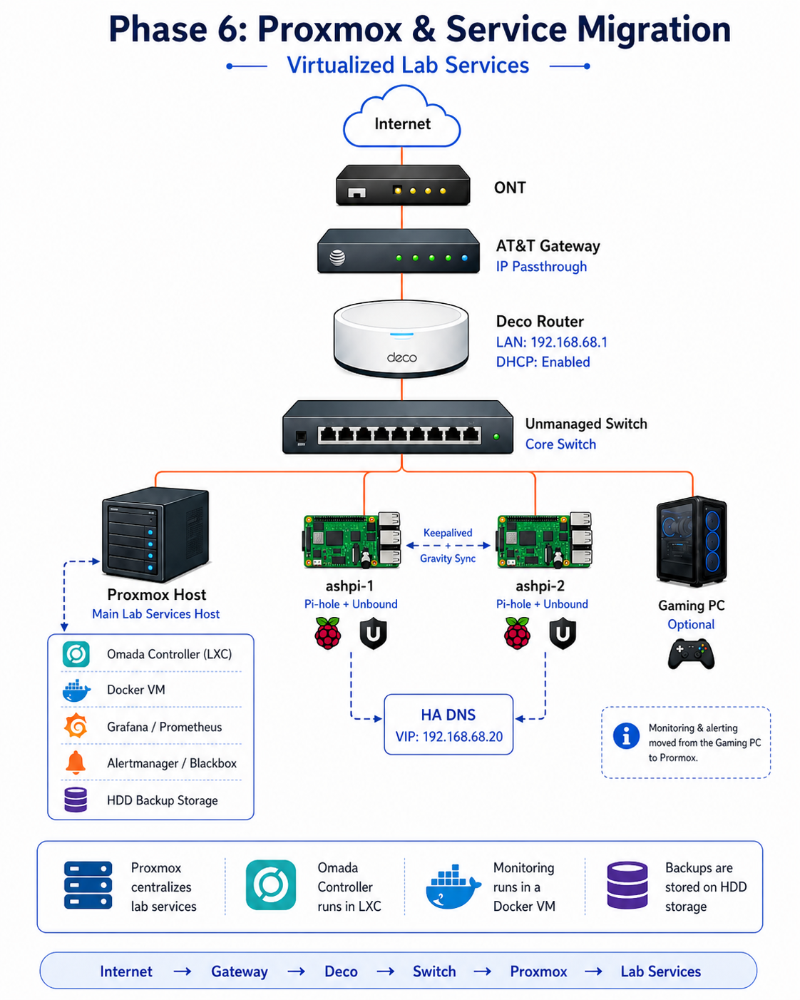
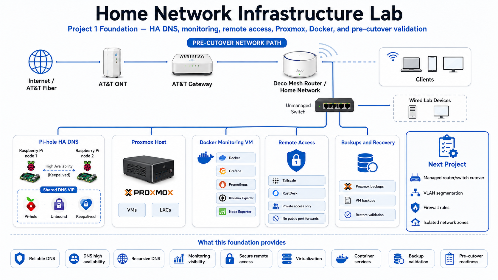

# Phase 6 Diagrams — Proxmox, Omada & Monitoring Foundation

## Phase 6 Proxmox Service Migration

---

## Final Infrastructure Foundation

---

## What This Shows

- Proxmox hosts the infrastructure service layer.
- Omada Controller runs in an LXC container.
- Monitoring services run in a dedicated Docker VM.
- Grafana, Prometheus, Alertmanager, and exporters are isolated from the desktop workstation.
- Core infrastructure services now operate independently from daily-use systems.

---

## Result

Phase 6 migrates core infrastructure services into Proxmox, improving operational stability, service separation, and long-term maintainability.
