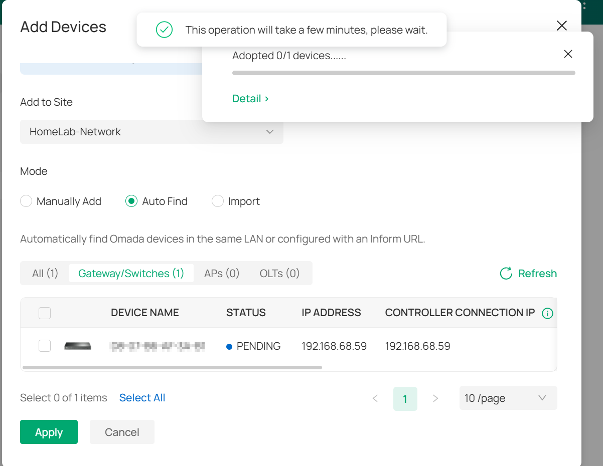

# Managed Switch Pre-Staging

## Overview

This document covers the managed switch pre-staging completed before the Phase 7 router and switch cutover.

The goal was to adopt the managed switch into Omada, validate connectivity, keep all ports on the default flat LAN, and prepare the switch to become the core switch during the ER605 cutover.

This was completed before VLAN segmentation. VLANs will be handled later in Phase 8.

---

## Why This Was Done Before Cutover

Pre-staging the switch before the live router cutover reduced risk and downtime.

This allowed the switch to be validated while the current network was still stable.

The staging process confirmed:

- the switch could be discovered by Omada
- the switch could be adopted into the Omada Controller
- the switch could operate on the existing flat LAN
- clients connected through the switch could reach DNS, Proxmox, Omada, and Grafana
- the switch was ready to become the core switch during Phase 7

---

## Current Switch State

During pre-staging, the switch received a temporary DHCP address from the current Deco-managed network.

| State | IP Address | Notes |
|---|---:|---|
| Temporary Staging IP | `192.168.68.59` | Assigned during pre-cutover testing |
| Planned Final Management IP | `192.168.68.2` | To be assigned/reserved after ER605 cutover |
| Omada Controller | `192.168.68.10` | Controller used to adopt/manage the switch |
| VLAN State | Default LAN / VLAN 1 only | No VLAN segmentation yet |

The switch could not be reserved as `192.168.68.2` from the Deco DHCP interface during staging, so the temporary DHCP address was kept for Phase 6 validation.

The final management IP of `192.168.68.2` will be assigned during Phase 7 after the ER605 becomes the active router/DHCP server.

---

## Target Phase 7 Switch Configuration

| Item | Planned Value |
|---|---:|
| Managed Switch IP | `192.168.68.2` |
| Gateway | `192.168.68.1` |
| DNS | `192.168.68.20` |
| Controller | `192.168.68.10` |
| VLAN State | Flat LAN during cutover, VLANs later in Phase 8 |

---

## Initial Port Plan

| Port | Planned Use |
|---:|---|
| 1 | Uplink to ER605 LAN |
| 2 | Proxmox Host |
| 3 | ashpi-1 |
| 4 | ashpi-2 |
| 5 | Main Deco AP |
| 6 | Gaming PC |
| 7 | Optional unmanaged switch |
| 8 | Spare / laptop testing |

During Phase 6 staging, Port 1 was used as a temporary uplink to the existing working LAN.

During Phase 7 cutover, Port 1 will become the uplink to the ER605 LAN.

---

## Steps Completed

1. Connected the managed switch to the current working LAN.
2. Opened the Omada Controller at `https://192.168.68.10:8043`.
3. Confirmed the switch appeared as pending adoption.
4. Adopted the switch into Omada.
5. Kept the switch on the default LAN / VLAN 1.
6. Left VLAN segmentation unconfigured.
7. Tested connectivity through the switch using a client device.
8. Confirmed access to core services through the switch.

---

## Validation Commands

Validation was performed from a client connected through the managed switch.

```powershell
ipconfig /all
ping 192.168.68.1
ping 192.168.68.10
ping 192.168.68.20
ping 192.168.68.59
ping 192.168.68.80
ping 192.168.68.81
nslookup google.com 192.168.68.20
```

Browser validation:

```text
Omada:    https://192.168.68.10:8043
Proxmox:  https://192.168.68.80:8006
Grafana:  http://192.168.68.81:3000
```

---

## Screenshot Evidence

### Switch Pending Adoption



This screenshot shows the managed switch discovered by the Omada Controller before adoption.

---

### Switch Adopted in Omada


This screenshot shows the managed switch successfully adopted into Omada.

---

### Omada Controller Dashboard


This screenshot confirms the Omada Controller was reachable and managing the network environment during switch staging.

---

### Client Test Through Managed Switch


This screenshot validates that a client connected through the managed switch could reach core services and DNS.

---

## Result

The managed switch was successfully pre-staged.

The switch was adopted into Omada, validated on the existing flat LAN, and confirmed ready for the Phase 7 cutover.

The final switch management IP of `192.168.68.2` will be assigned after the ER605 becomes the active router/DHCP server.

---

## Next Step

Phase 7 will move the ER605 into the live network path, make the managed switch the core switch, and place the Deco mesh into AP mode.

VLAN segmentation will be completed later in Phase 8.
