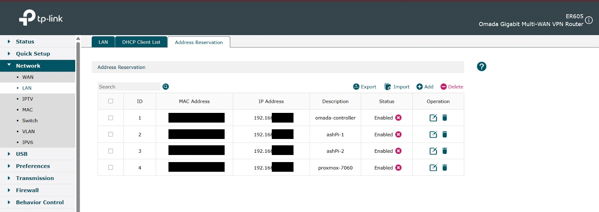
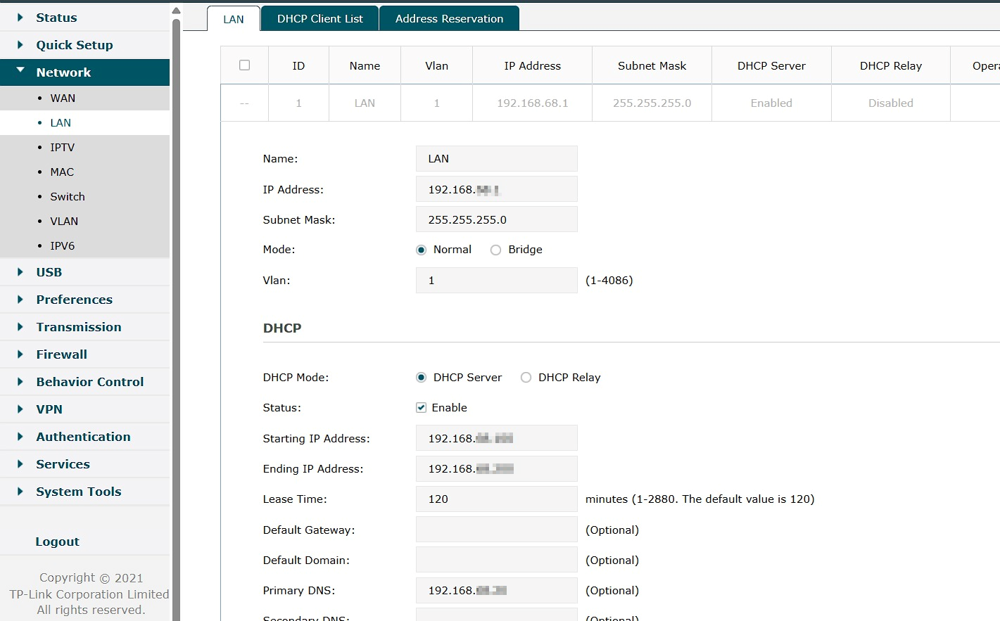
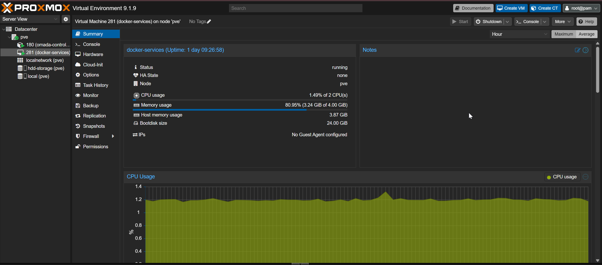
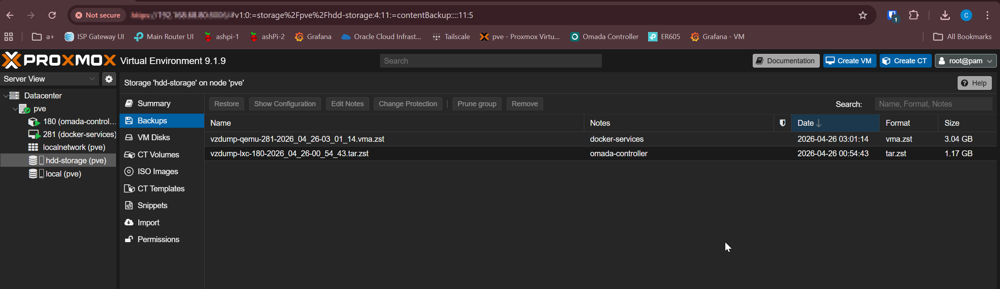
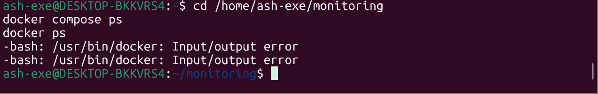
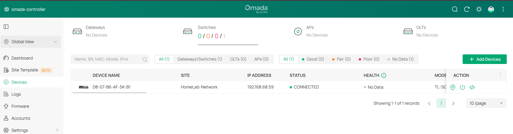
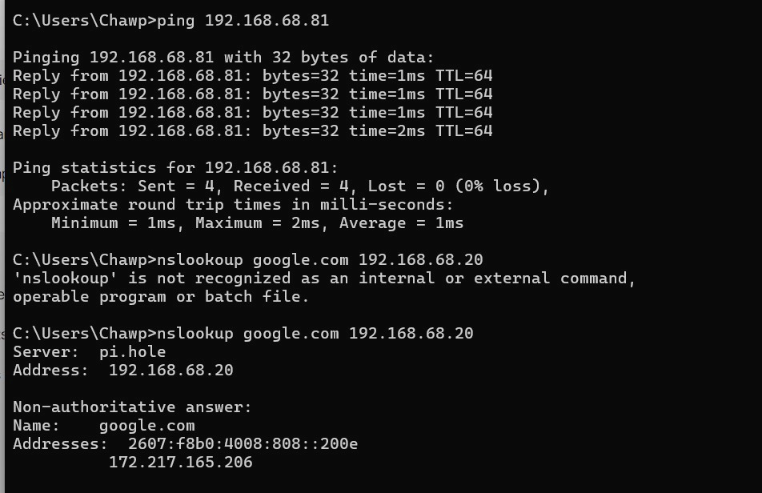

# Phase 6 Validation — Proxmox, Omada & Docker Monitoring Foundation ✅

## Validation Summary

| Validation Item | Expected Result | Status |
|---|---|---|
| Proxmox host online | Host reachable at `192.168.68.80` | Passed |
| Omada Controller online | Controller reachable at `192.168.68.10:8043` | Passed |
| ER605 preconfigured | LAN/DHCP/DNS staged before cutover | Passed |
| Docker monitoring VM running | VM online at `192.168.68.81` | Passed |
| Monitoring stack migrated | Grafana/Prometheus stack runs from VM | Passed |
| Grafana reachable | UI reachable from Docker VM IP | Passed |
| Gaming PC no longer required | Old Docker stack stopped | Passed |
| Proxmox backup complete | Backup stored on `hdd-storage` | Passed |
| Managed switch adopted | Switch visible and adopted in Omada | Passed |
| Client through switch validated | Client reached core services through switch | Passed |

---

## 1. Proxmox Host Validation

Result: Proxmox host is online and hosting lab services.

---

## 2. Omada Controller Validation

Result: Omada Controller is running from the Proxmox LXC.

---

## 3. ER605 Preconfiguration Validation

Result: ER605 was staged with the existing LAN plan and Pi-hole VIP DNS target.

---

## 4. Docker Monitoring VM Validation

Result: Monitoring stack runs on the dedicated Docker VM.

---

## 5. Grafana Validation

Result: Grafana is reachable from the Docker VM IP.

---

## 6. Backup Validation

Result: Proxmox backup target is working.

---

## 7. Gaming PC Dependency Removed

Result: Monitoring no longer depends on the gaming PC.

---

## 8. Managed Switch Pre-Staging

Result: Managed switch was adopted and tested before future cutover work.

---

## Conclusion

Phase 6 passed validation.

The lab now has a dedicated Proxmox infrastructure foundation, Omada Controller, Docker monitoring VM, staged ER605 config, managed switch pre-staging, and backup coverage.
