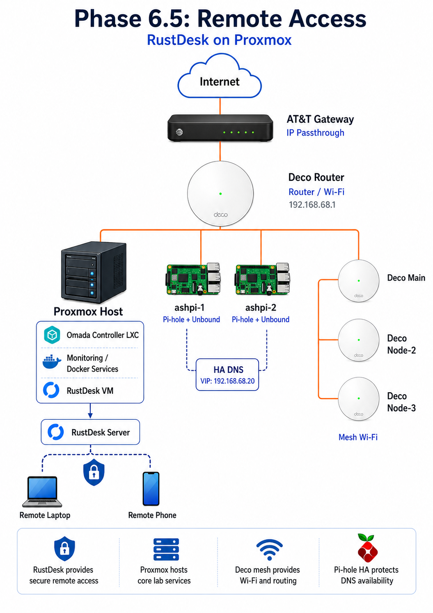

# Phase 6.5 — RustDesk Remote Access & VM Hardening 🔐


---

## Phase Summary

Phase 6.5 added self-hosted RustDesk remote access and VM hardening to the lab.

RustDesk server components were deployed in a dedicated Debian VM and kept LAN-only for this project. The monitoring VM was also cleaned up with Docker log rotation, Prometheus retention limits, Portainer Agent, disk expansion, and final backup validation.

---

## What This Phase Demonstrates

| Area | Demonstrated Skill |
|---|---|
| Self-hosting | RustDesk server deployment |
| Remote access | `hbbs` and `hbbr` services |
| Virtualization | Dedicated Proxmox VM |
| Docker services | Containerized RustDesk deployment |
| VM hardening | SSH and LAN-only firewall posture |
| Docker maintenance | Log rotation and retention controls |
| Backup readiness | Final Proxmox backup evidence |
| Scope control | Remote access validated without public exposure |

---

## Service Layout

```text
Proxmox Host
  ↓
RustDesk Server VM - 192.168.68.83
  ├── rustdesk-hbbs
  └── rustdesk-hbbr

Trusted LAN Clients
  ↓
Self-hosted RustDesk Server
```



---

## Phase Documentation

| Page | Description |
|---|---|
| [Overview](./overview.md) | Phase 6.5 case-study overview |
| [Step-by-Step Guide](./step-by-step.md) | Implementation flow |
| [Validation](./validation.md) | Validation evidence |
| [Diagrams](./diagrams.md) | RustDesk service architecture |

---

## Outcome

The lab included a self-hosted remote access service with a documented VM baseline, a LAN-only exposure boundary, and final pre-closeout maintenance evidence.
