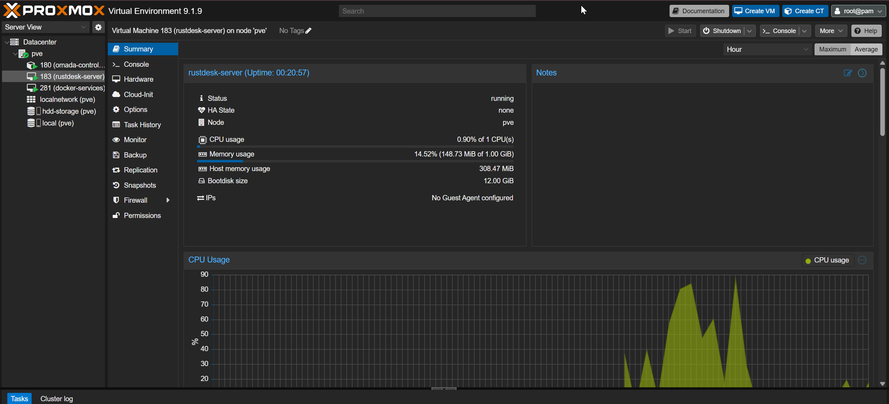
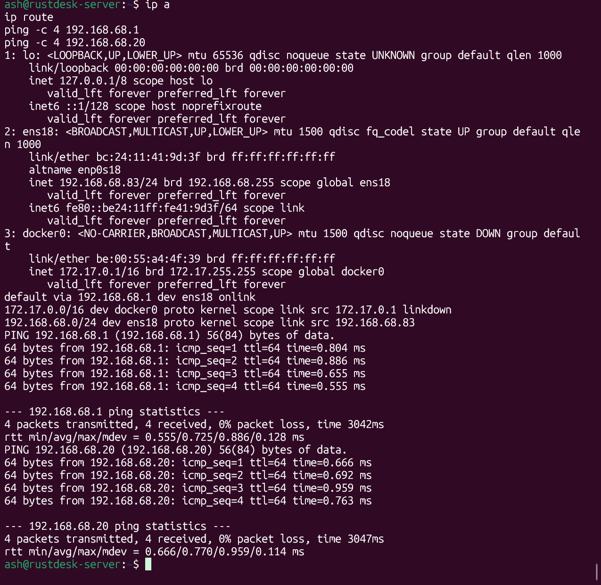
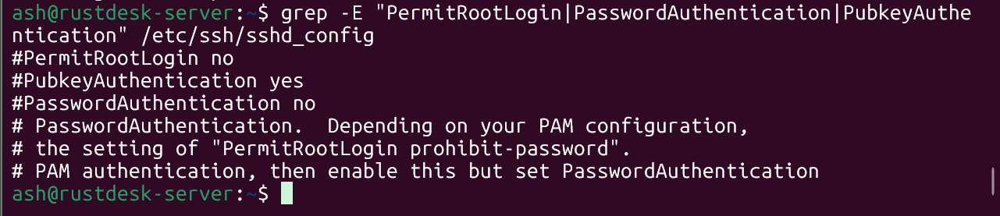
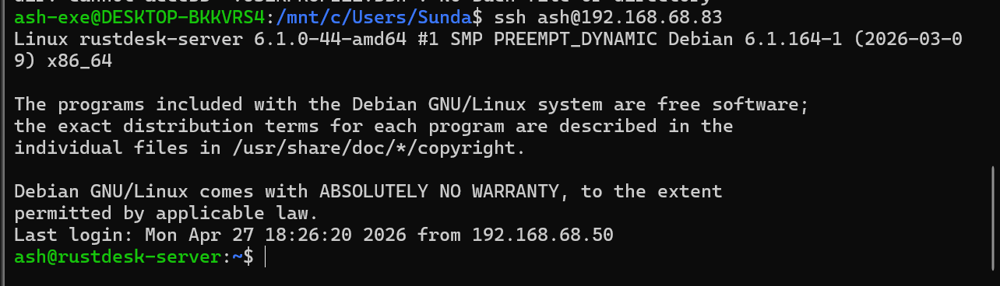
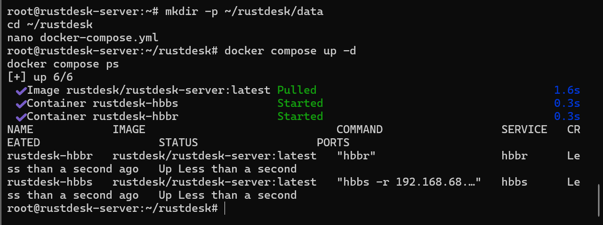
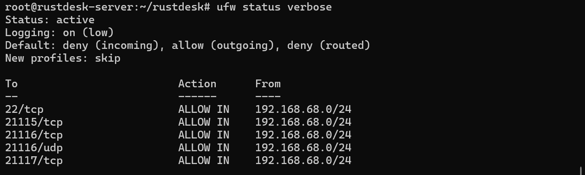
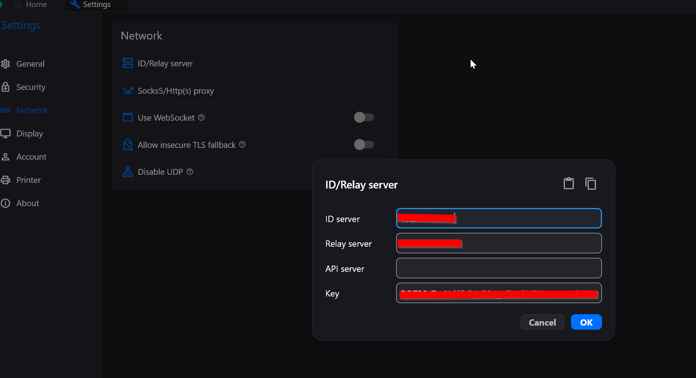
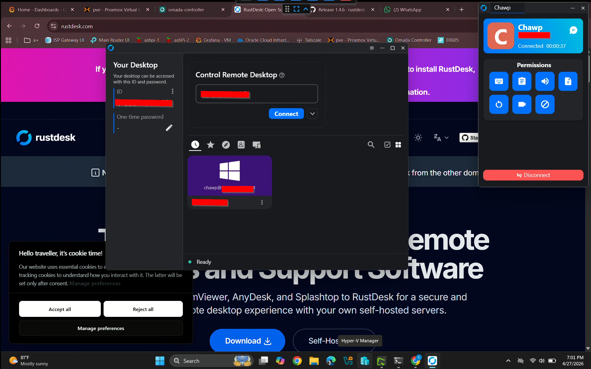
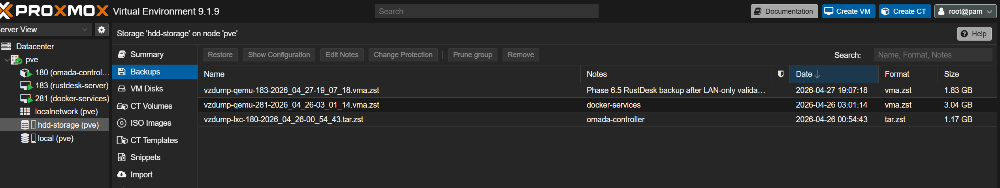

# Phase 6.5 — RustDesk Remote Access Hardening

## Overview

Phase 6.5 documents the self-hosted RustDesk remote access layer running on the Proxmox infrastructure host.

This phase deploys a lightweight Debian VM to run RustDesk Server OSS using Docker Compose. The goal was to validate remote access between trusted devices while keeping the server restricted to the local LAN during initial testing.

## What This Phase Includes

- Created a lightweight Debian VM for RustDesk
- Assigned the VM a static IP: `192.168.68.83`
- Verified network connectivity to the gateway and Pi-hole DNS
- Configured SSH key-based access
- Hardened SSH by disabling password authentication and root login
- Installed Docker on Debian
- Deployed RustDesk Server OSS using Docker Compose
- Ran the RustDesk `hbbs` and `hbbr` services
- Configured UFW with LAN-only rules
- Configured RustDesk clients to use the self-hosted server
- Validated remote access between laptop, gaming PC, and phone
- Created Proxmox backup evidence for the RustDesk VM

## Current IP Plan

| Device / Service | IP Address | Purpose |
|---|---:|---|
| Proxmox Host | `192.168.68.80` | Virtualization host |
| RustDesk VM | `192.168.68.83` | Self-hosted RustDesk server |
| Gateway | `192.168.68.1` | Default gateway |
| Pi-hole VIP | `192.168.68.20` | DNS resolver |
| Omada Controller | `192.168.68.10` | Network controller |

## Architecture

Proxmox Host - `192.168.68.80`

- Debian RustDesk VM - `192.168.68.83`
  - Docker
  - `rustdesk-hbbs`
  - `rustdesk-hbbr`
  - UFW LAN-only firewall rules

## Security Approach

RustDesk was configured for internal validation only.

At this stage:

- No public port forwarding was configured
- RustDesk access is limited to `192.168.68.0/24`
- SSH root login is disabled
- SSH password authentication is disabled
- RustDesk client IDs and keys are blurred in public screenshots

Public access, if added later, will be handled after the ER605 cutover and additional firewall review.

## Screenshot Evidence

### Debian VM Summary

### Debian Network Configuration

### SSH Hardening Configuration

### SSH Key Login Validation

### RustDesk Docker Compose Running

### UFW LAN-Only Firewall Rules

### RustDesk Client Network Settings

### RustDesk Client Connection Test

### RustDesk Proxmox Backup

## Documentation

- [Overview](./overview.md)
- [Step-by-Step Guide](./step-by-step.md)
- [Validation](./validation.md)
- [Diagrams](./diagrams.md)

## Result

RustDesk remote access was successfully validated between the laptop, gaming PC, and phone using the self-hosted RustDesk server.

The server is running on Debian, managed by Docker Compose, protected by UFW LAN-only firewall rules, and backed up through Proxmox.
