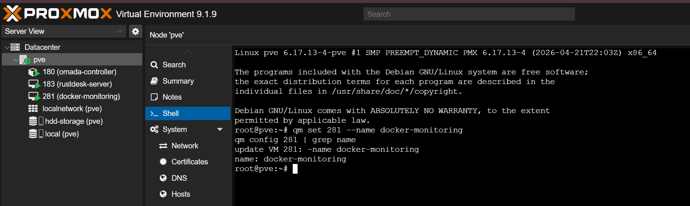
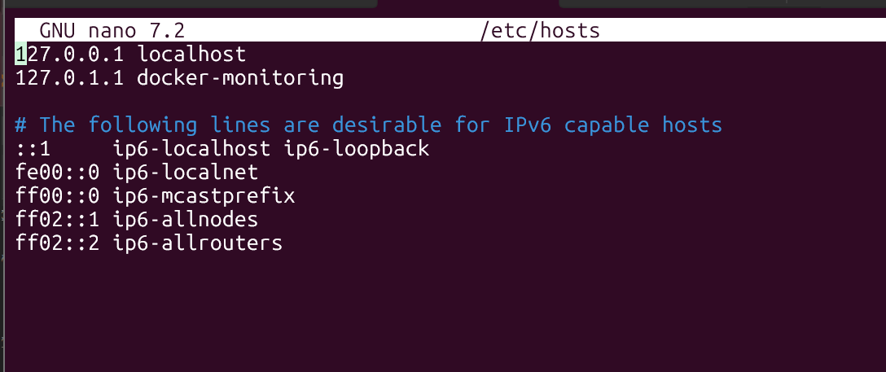
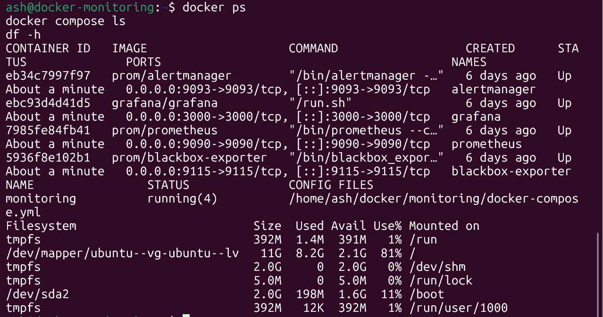
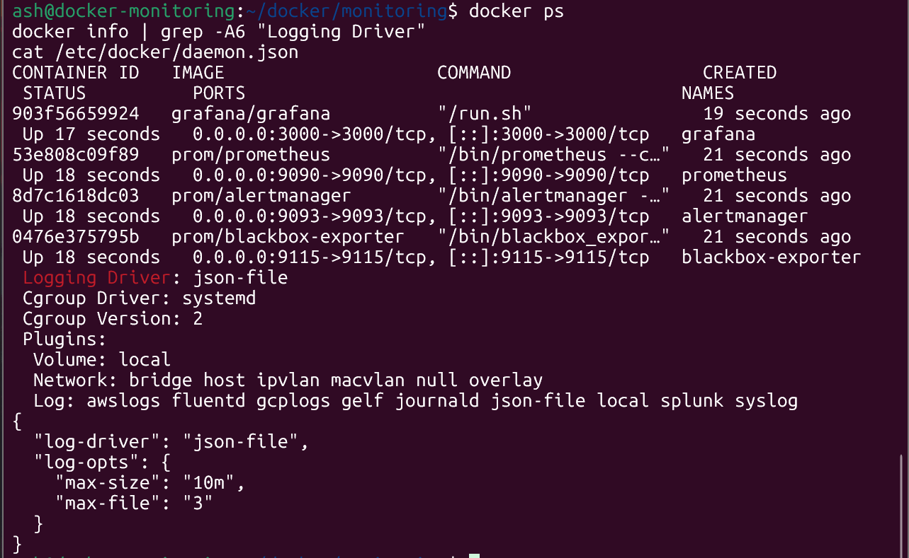
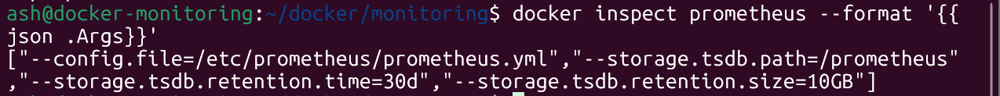
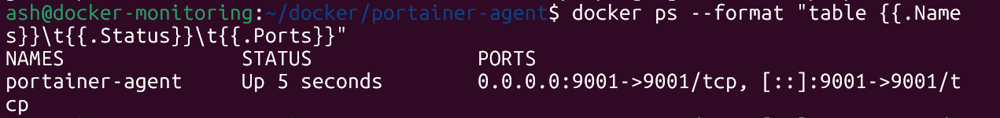
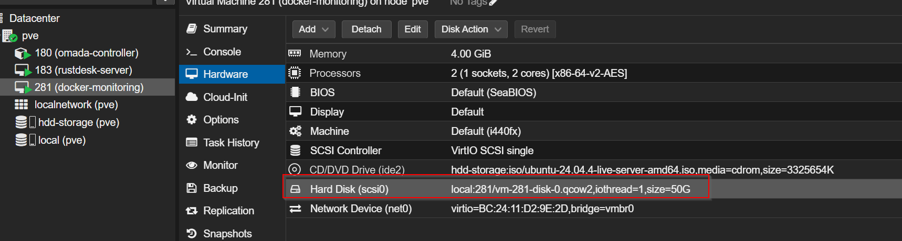
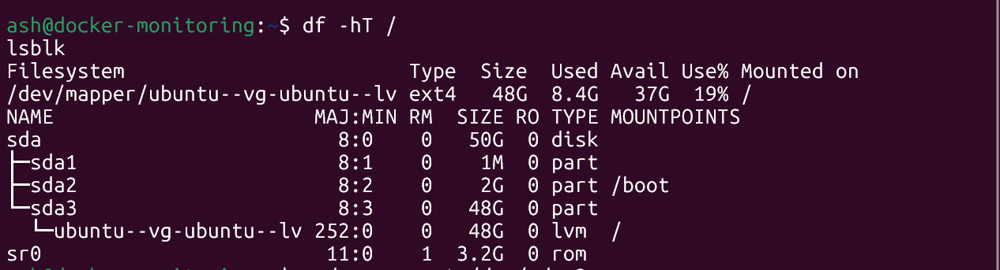
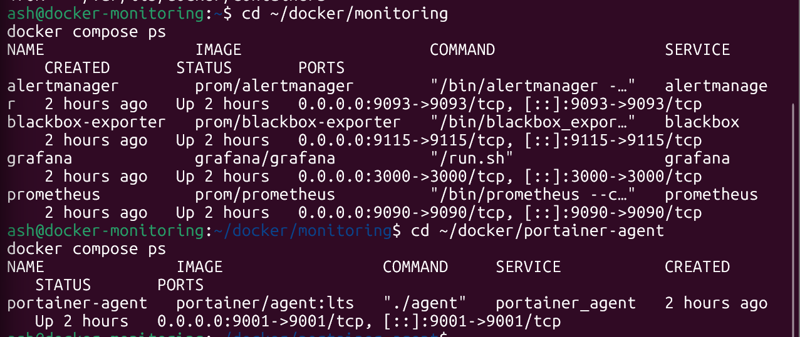
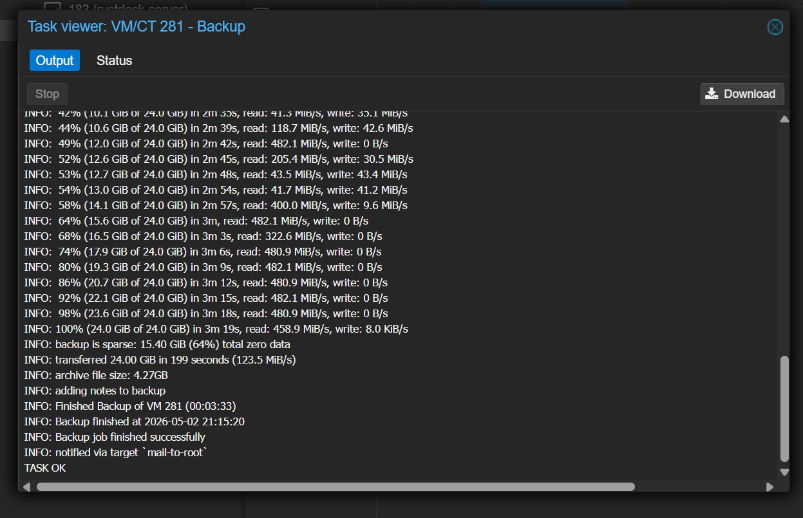

# Phase 6.5 — RustDesk Remote Access & VM Hardening 🔐

## 📌 Overview

Phase 6.5 is the final pre-cutover hardening phase for Project 1.

This phase added self-hosted RustDesk remote access, cleaned up the monitoring VM, installed the Portainer Agent, controlled Docker/Prometheus disk growth, expanded the monitoring VM disk, and confirmed final backup readiness.

This phase exists to make sure the lab can be accessed, monitored, and recovered before future network cutover and segmentation work.

---

## 🎯 Objectives

The goals for this phase were to:

- deploy and validate self-hosted RustDesk remote access
- harden SSH on the RustDesk VM
- keep RustDesk LAN-only
- rename `docker-services` to `docker-monitoring`
- configure Docker log rotation
- configure Prometheus retention
- install Portainer Agent on the monitoring VM
- expand the monitoring VM disk to `50GB`
- validate Docker after resize
- create final Proxmox backup evidence

---

## 🧩 Workstreams

### RustDesk Remote Access

- Created a lightweight Debian VM for RustDesk
- Assigned the VM a static IP: `192.168.68.83`
- Configured SSH key-based login
- Hardened SSH
- Deployed RustDesk Server OSS using Docker Compose
- Configured UFW LAN-only rules
- Validated remote access between laptop, gaming PC, and phone
- Created a Proxmox backup

### Docker Monitoring VM Hardening

- Renamed Proxmox VM `docker-services` to `docker-monitoring`
- Renamed Ubuntu hostname to `docker-monitoring`
- Confirmed the monitoring stack survived the rename
- Configured Docker log rotation
- Set Prometheus retention to `30d` / `10GB`
- Installed Portainer Agent
- Resized the disk to `50GB`
- Expanded the filesystem inside Ubuntu
- Validated Docker after the resize
- Created a final backup

---

## 🌐 Final VM Layout

| VM / CT | Name | IP Address | Role |
|---:|---|---:|---|
| CT 180 | `omada-controller` | `192.168.68.10` | Omada Controller |
| VM 183 | `rustdesk-server` | `192.168.68.83` | Self-hosted RustDesk server |
| VM 281 | `docker-monitoring` | `192.168.68.81` | Monitoring stack and Portainer Agent |

Future app hosting will be handled separately:

| Future VM | Name | Planned IP | Role |
|---|---|---:|---|
| Future | `docker-apps` | `192.168.68.82` | Self-hosted apps and Portainer Server |

---

## 🛡️ Security Notes

- RustDesk is LAN-only.
- Portainer Agent is LAN-only.
- No RustDesk or Portainer ports are publicly forwarded.
- RustDesk SSH password authentication is disabled.
- RustDesk SSH root login is disabled.
- Docker log rotation reduces uncontrolled log growth.
- Prometheus retention is limited to `30d` / `10GB`.
- Proxmox backups exist after validation.

---

## 🧪 RustDesk Evidence

---

## 🧪 Docker Monitoring Evidence

---

## 📚 Documentation

- [Overview](./overview.md)
- [Step-by-Step](./step-by-step.md)
- [Validation](./validation.md)
- [Diagrams](./diagrams.md)

---

## ✅ Phase Result

Phase 6.5 validated remote access, VM hardening, monitoring maintenance, disk capacity, Portainer Agent readiness, and backup coverage.

This completes the final pre-closeout technical work for Project 1.
